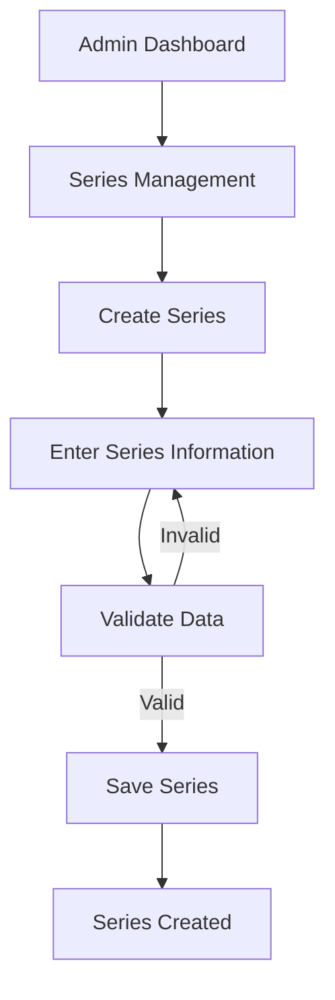
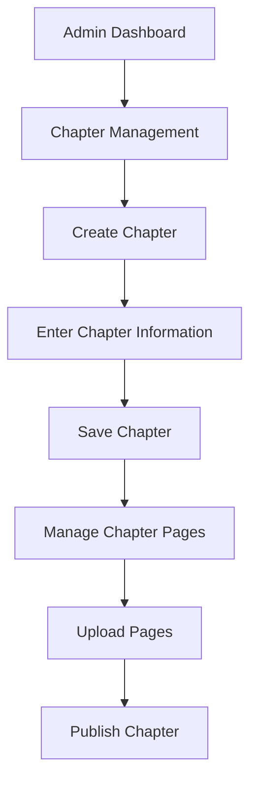
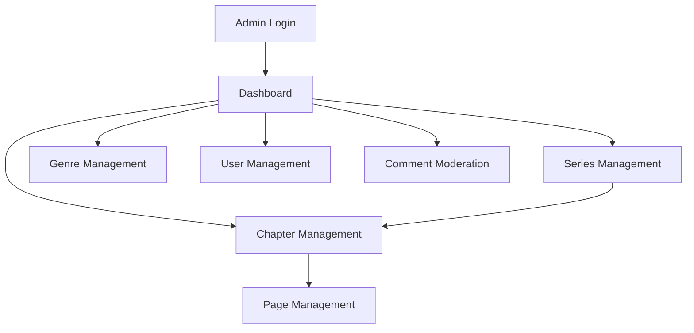

# Admin Wireframes

## 1. Overview

This document defines the wireframes and page structure for the Admin side of the Manga / Manhwa / Manhua Reader & CMS.

The Admin interface is responsible for managing:

* Series
* Genres
* Chapters
* Chapter pages
* Users
* Comments
* Publishing status

The wireframes focus on structure and functionality rather than final visual styling.

---

# 2. Admin Navigation Structure

```text
Admin
│
├── Login
│
└── Dashboard
    │
    ├── Series Management
    │   ├── Series List
    │   ├── Create Series
    │   └── Edit Series
    │
    ├── Genre Management
    │   ├── Genre List
    │   ├── Create Genre
    │   └── Edit Genre
    │
    ├── Chapter Management
    │   ├── Chapter List
    │   ├── Create Chapter
    │   └── Edit Chapter
    │
    ├── Chapter Page Management
    │   ├── Page List
    │   ├── Upload Pages
    │   └── Reorder Pages
    │
    ├── User Management
    │   └── User List
    │
    └── Comment Moderation
        └── Comment List
```

---

# 3. Global Admin Layout

The Admin interface uses a sidebar-based layout.

```text
┌──────────────────────────────────────────────────────────────┐
│ MangaReader CMS                                  Admin ▼    │
├──────────────────┬───────────────────────────────────────────┤
│                  │                                           │
│ Dashboard        │                                           │
│                  │                                           │
│ Series           │              PAGE CONTENT                 │
│ Genres           │                                           │
│ Chapters         │                                           │
│ Users            │                                           │
│ Comments         │                                           │
│                  │                                           │
│ ───────────────  │                                           │
│ Logout           │                                           │
│                  │                                           │
└──────────────────┴───────────────────────────────────────────┘
```

## 3.1 Sidebar

The sidebar contains:

```text
Dashboard
Series
Genres
Chapters
Users
Comments
────────────
Logout
```

---

# 4. Admin Login

## 4.1 Purpose

The Admin Login page allows authorized administrators to access the CMS.

## 4.2 Wireframe

```text
┌──────────────────────────────────────────────────────────────┐
│                                                              │
│                       MangaReader CMS                        │
│                                                              │
│                       Admin Login                            │
│                                                              │
│ Email                                                        │
│ ┌────────────────────────────────────────────┐               │
│ │                                            │               │
│ └────────────────────────────────────────────┘               │
│                                                              │
│ Password                                                     │
│ ┌────────────────────────────────────────────┐               │
│ │                                            │               │
│ └────────────────────────────────────────────┘               │
│                                                              │
│                    [ Login ]                                 │
│                                                              │
└──────────────────────────────────────────────────────────────┘
```

Only users with the appropriate administrator role should be allowed to access the Admin CMS.

---

# 5. Dashboard

## 5.1 Purpose

The Dashboard provides a quick overview of the system.

It displays:

* Total series
* Total chapters
* Total users
* Pending comments
* Recently added series
* Recently published chapters

---

## 5.2 Wireframe

```text
┌──────────────────────────────────────────────────────────────┐
│ Dashboard                                      Admin ▼      │
├──────────────────┬───────────────────────────────────────────┤
│ Dashboard        │ Dashboard                                 │
│ Series           │                                           │
│ Genres           │ ┌────────┐ ┌────────┐ ┌────────┐         │
│ Chapters         │ │ Series │ │Chapter │ │ Users  │         │
│ Users            │ │  120   │ │  850   │ │ 1,240  │         │
│ Comments         │ └────────┘ └────────┘ └────────┘         │
│                  │                                           │
│                  │ ┌───────────────────────────────┐         │
│                  │ │ Pending Comments              │         │
│                  │ │ 24                            │         │
│                  │ └───────────────────────────────┘         │
│                  │                                           │
│                  │ Recently Added Series                     │
│                  │ ─────────────────────────────────         │
│                  │ Series A                     27 Sep       │
│                  │ Series B                     26 Sep       │
│                  │ Series C                     25 Sep       │
│                  │                                           │
│                  │ Recently Published Chapters               │
│                  │ ─────────────────────────────────         │
│                  │ Series A - Chapter 20        27 Sep       │
│                  │ Series B - Chapter 15        27 Sep       │
│                  │                                           │
└──────────────────┴───────────────────────────────────────────┘
```

---

# 6. Series Management

## 6.1 Series List

The Series List displays all series in the system.

```text
┌──────────────────────────────────────────────────────────────┐
│ Series Management                         [ + Add Series ]  │
├──────────────────────────────────────────────────────────────┤
│ Search series...                               [ Search ]    │
│                                                              │
│ Filter: [ Content Type ▼ ] [ Genre ▼ ]                       │
│                                                              │
│ ┌───────┬──────────────────┬─────────┬─────────┬──────────┐ │
│ │ Cover │ Title            │ Type    │ Status  │ Actions  │ │
│ ├───────┼──────────────────┼─────────┼─────────┼──────────┤ │
│ │ Image │ Solo Leveling    │ Manhwa  │ Active  │ Edit     │ │
│ │ Image │ One Piece        │ Manga   │ Active  │ Edit     │ │
│ │ Image │ Example Series   │ Manhua  │ Active  │ Edit     │ │
│ └───────┴──────────────────┴─────────┴─────────┴──────────┘ │
│                                                              │
│                 1  2  3  4  Next →                          │
└──────────────────────────────────────────────────────────────┘
```

---

# 7. Create Series

## 7.1 Purpose

Allows an administrator to create a new series.

## 7.2 Wireframe

```text
┌──────────────────────────────────────────────────────────────┐
│ Create Series                                                │
├──────────────────────────────────────────────────────────────┤
│                                                              │
│ Title                                                        │
│ ┌────────────────────────────────────────────┐               │
│ │                                            │               │
│ └────────────────────────────────────────────┘               │
│                                                              │
│ Content Type                                                 │
│ ┌────────────────────────────────────────────┐               │
│ │ Select content type                    ▼  │               │
│ └────────────────────────────────────────────┘               │
│                                                              │
│ Genres                                                       │
│ ┌────────────────────────────────────────────┐               │
│ │ Select genres                          ▼  │               │
│ └────────────────────────────────────────────┘               │
│                                                              │
│ Description                                                  │
│ ┌────────────────────────────────────────────┐               │
│ │                                            │               │
│ │                                            │               │
│ └────────────────────────────────────────────┘               │
│                                                              │
│ Cover                                                        │
│ ┌────────────────────────────────────────────┐               │
│ │              Upload Cover                  │               │
│ └────────────────────────────────────────────┘               │
│                                                              │
│                         [ Cancel ] [ Create ]                │
│                                                              │
└──────────────────────────────────────────────────────────────┘
```

---

# 8. Edit Series

The Edit Series page uses the same structure as Create Series.

```text
┌──────────────────────────────────────────────────────────────┐
│ Edit Series                                                  │
├──────────────────────────────────────────────────────────────┤
│                                                              │
│ Title                                                        │
│ [ Solo Leveling                                  ]           │
│                                                              │
│ Content Type                                                 │
│ [ Manhwa                                      ▼ ]            │
│                                                              │
│ Genres                                                       │
│ [ Action, Fantasy                             ▼ ]            │
│                                                              │
│ Description                                                  │
│ [ Existing description                           ]            │
│                                                              │
│ Current Cover                                                │
│ [ Cover Image ]                                              │
│                                                              │
│ Replace Cover                                                │
│ [ Upload New Cover ]                                         │
│                                                              │
│                     [ Cancel ] [ Save Changes ]              │
│                                                              │
└──────────────────────────────────────────────────────────────┘
```

---

# 9. Genre Management

## 9.1 Purpose

Administrators can create, edit, and remove genres.

## 9.2 Wireframe

```text
┌──────────────────────────────────────────────────────────────┐
│ Genre Management                         [ + Add Genre ]    │
├──────────────────────────────────────────────────────────────┤
│                                                              │
│ ┌──────────────┬─────────────────────────┬─────────────────┐ │
│ │ Name         │ Slug                    │ Actions         │ │
│ ├──────────────┼─────────────────────────┼─────────────────┤ │
│ │ Action       │ action                  │ Edit | Delete   │ │
│ │ Adventure    │ adventure               │ Edit | Delete   │ │
│ │ Fantasy      │ fantasy                 │ Edit | Delete   │ │
│ │ Romance      │ romance                 │ Edit | Delete   │ │
│ └──────────────┴─────────────────────────┴─────────────────┘ │
│                                                              │
└──────────────────────────────────────────────────────────────┘
```

---

# 10. Create Genre

```text
┌──────────────────────────────────────────────────────────────┐
│ Create Genre                                                 │
├──────────────────────────────────────────────────────────────┤
│                                                              │
│ Name                                                         │
│ ┌────────────────────────────────────────────┐               │
│ │ Fantasy                                   │               │
│ └────────────────────────────────────────────┘               │
│                                                              │
│ Slug                                                         │
│ ┌────────────────────────────────────────────┐               │
│ │ fantasy                                   │               │
│ └────────────────────────────────────────────┘               │
│                                                              │
│ Description                                                  │
│ ┌────────────────────────────────────────────┐               │
│ │                                            │               │
│ └────────────────────────────────────────────┘               │
│                                                              │
│                         [ Cancel ] [ Create ]                │
│                                                              │
└──────────────────────────────────────────────────────────────┘
```

---

# 11. Chapter Management

## 11.1 Chapter List

```text
┌──────────────────────────────────────────────────────────────┐
│ Chapter Management                       [ + Add Chapter ] │
├──────────────────────────────────────────────────────────────┤
│                                                              │
│ Series: [ Solo Leveling ▼ ]                                  │
│                                                              │
│ ┌─────────┬──────────────────┬───────────┬─────────┬───────┐│
│ │ Chapter │ Title            │ Status    │ Publish │Action ││
│ ├─────────┼──────────────────┼───────────┼─────────┼───────┤│
│ │ 215     │ The Beginning    │ Published │ Sep 27  │ Edit  ││
│ │ 214     │ The Battle       │ Published │ Sep 20  │ Edit  ││
│ │ 213     │ Preparation      │ Draft     │ —       │ Edit  ││
│ └─────────┴──────────────────┴───────────┴─────────┴───────┘│
│                                                              │
└──────────────────────────────────────────────────────────────┘
```

---

# 12. Create Chapter

## 12.1 Wireframe

```text
┌──────────────────────────────────────────────────────────────┐
│ Create Chapter                                               │
├──────────────────────────────────────────────────────────────┤
│                                                              │
│ Series                                                       │
│ [ Solo Leveling                              ▼ ]             │
│                                                              │
│ Chapter Number                                               │
│ [ 216                                        ]               │
│                                                              │
│ Chapter Title                                                │
│ [ The Next Battle                              ]             │
│                                                              │
│ Publication Date                                             │
│ [ 2026-09-28                                  ]              │
│                                                              │
│ Status                                                       │
│ [ Draft                                      ▼ ]              │
│                                                              │
│                      [ Cancel ] [ Create ]                   │
│                                                              │
└──────────────────────────────────────────────────────────────┘
```

Creating the chapter does not necessarily publish it.

A chapter can remain in:

```text
Draft
```

until the administrator explicitly publishes it.

---

# 13. Chapter Edit

```text
┌──────────────────────────────────────────────────────────────┐
│ Edit Chapter: Solo Leveling - Chapter 216                   │
├──────────────────────────────────────────────────────────────┤
│                                                              │
│ Chapter Number                                               │
│ [ 216                                        ]               │
│                                                              │
│ Title                                                        │
│ [ The Next Battle                            ]               │
│                                                              │
│ Publication Date                                             │
│ [ 2026-09-28                                ]                │
│                                                              │
│ Status                                                       │
│ [ Draft                                      ▼ ]              │
│                                                              │
│ Pages                                                        │
│ [ Manage Chapter Pages ]                                     │
│                                                              │
│                   [ Save Changes ]                            │
│                                                              │
└──────────────────────────────────────────────────────────────┘
```

---

# 14. Chapter Page Management

## 14.1 Purpose

Chapter Page Management handles the image pages belonging to a chapter.

Administrators can:

* Upload pages
* View pages
* Delete pages
* Reorder pages

---

## 14.2 Wireframe

```text
┌──────────────────────────────────────────────────────────────┐
│ Chapter 216 - Page Management                               │
├──────────────────────────────────────────────────────────────┤
│                                                              │
│ [ + Upload Pages ]                                           │
│                                                              │
│ Drag and drop pages to change their order.                   │
│                                                              │
│ ┌─────────────┐ ┌─────────────┐ ┌─────────────┐             │
│ │             │ │             │ │             │             │
│ │    PAGE 1   │ │    PAGE 2   │ │    PAGE 3   │             │
│ │             │ │             │ │             │             │
│ └─────────────┘ └─────────────┘ └─────────────┘             │
│      ↑              ↑              ↑                         │
│   page 1         page 2         page 3                       │
│                                                              │
│ ┌─────────────┐ ┌─────────────┐                             │
│ │             │ │             │                             │
│ │    PAGE 4   │ │    PAGE 5   │                             │
│ │             │ │             │                             │
│ └─────────────┘ └─────────────┘                             │
│                                                              │
│                         [ Save Order ]                       │
│                                                              │
└──────────────────────────────────────────────────────────────┘
```

---

# 15. Upload Chapter Pages

```text
┌──────────────────────────────────────────────────────────────┐
│ Upload Chapter Pages                                         │
├──────────────────────────────────────────────────────────────┤
│                                                              │
│ Chapter: Solo Leveling - 216                                 │
│                                                              │
│ ┌──────────────────────────────────────────────┐             │
│ │                                              │             │
│ │       Drag & Drop Images Here               │             │
│ │                                              │             │
│ │               or                             │             │
│ │                                              │             │
│ │             [ Choose Files ]                │             │
│ │                                              │             │
│ └──────────────────────────────────────────────┘             │
│                                                              │
│ Selected Files:                                              │
│                                                              │
│ page-001.jpg                                  ✓               │
│ page-002.jpg                                  ✓               │
│ page-003.jpg                                  ✓               │
│ page-004.jpg                                  ✓               │
│                                                              │
│                    [ Upload Pages ]                           │
│                                                              │
└──────────────────────────────────────────────────────────────┘
```

The backend should validate uploaded files before storing them.

---

# 16. Publish / Unpublish Chapter

## 16.1 Draft State

```text
┌──────────────────────────────────────────────────────────────┐
│ Chapter 216                                                  │
│                                                              │
│ Status: DRAFT                                                │
│                                                              │
│ Pages: 24                                                    │
│ Publication Date: 28 Sep 2026                               │
│                                                              │
│                   [ Publish Chapter ]                        │
└──────────────────────────────────────────────────────────────┘
```

## 16.2 Published State

```text
┌──────────────────────────────────────────────────────────────┐
│ Chapter 216                                                  │
│                                                              │
│ Status: PUBLISHED                                            │
│                                                              │
│ Published: 28 Sep 2026                                      │
│                                                              │
│                 [ Unpublish Chapter ]                         │
└──────────────────────────────────────────────────────────────┘
```

A chapter should only become visible to readers when its status is `PUBLISHED`.

---

# 17. User Management

## 17.1 Purpose

Administrators can view and manage registered users.

## 17.2 Wireframe

```text
┌──────────────────────────────────────────────────────────────┐
│ User Management                                              │
├──────────────────────────────────────────────────────────────┤
│ Search users...                              [ Search ]      │
│                                                              │
│ ┌──────────────┬────────────────┬────────┬─────────────────┐ │
│ │ Username     │ Email          │ Role   │ Actions         │ │
│ ├──────────────┼────────────────┼────────┼─────────────────┤ │
│ │ Aldo         │ user@mail.com  │ Reader │ View / Manage   │ │
│ │ User123      │ user2@mail.com │ Reader │ View / Manage   │ │
│ │ Admin        │ admin@mail.com │ Admin  │ View / Manage   │ │
│ └──────────────┴────────────────┴────────┴─────────────────┘ │
│                                                              │
└──────────────────────────────────────────────────────────────┘
```

---

# 18. User Management Actions

Depending on authorization rules, an administrator may be able to:

* View user information
* Change user role
* Disable user access
* Restore user access

Example:

```text
┌──────────────────────────────────────────────────────────────┐
│ User: User123                                                │
├──────────────────────────────────────────────────────────────┤
│                                                              │
│ Username: User123                                            │
│ Email: user@example.com                                      │
│ Role: Reader                                                 │
│ Created: 25 Sep 2026                                         │
│                                                              │
│ Status: Active                                               │
│                                                              │
│ [ Change Role ] [ Disable User ]                             │
│                                                              │
└──────────────────────────────────────────────────────────────┘
```

---

# 19. Comment Moderation

## 19.1 Purpose

Administrators can review comments submitted by readers.

## 19.2 Wireframe

```text
┌──────────────────────────────────────────────────────────────┐
│ Comment Moderation                                           │
├──────────────────────────────────────────────────────────────┤
│                                                              │
│ Filter: [ Pending ▼ ]                                        │
│                                                              │
│ ┌──────────┬──────────────┬────────────────┬───────────────┐ │
│ │ User     │ Series       │ Comment        │ Actions       │ │
│ ├──────────┼──────────────┼────────────────┼───────────────┤ │
│ │ User123  │ Solo Leveling│ Great chapter! │ Approve       │ │
│ │ Aldo     │ One Piece   │ Interesting... │ Approve       │ │
│ └──────────┴──────────────┴────────────────┴───────────────┘ │
│                                                              │
└──────────────────────────────────────────────────────────────┘
```

---

# 20. Comment Actions

Possible actions include:

```text
Approve
Hide
Delete
```

Example:

```text
Comment: "Great chapter!"

[ Approve ] [ Hide ] [ Delete ]
```

The exact moderation behavior depends on the comment status rules defined by the backend.

---

# 21. Admin Workflow: Create Series



---

# 22. Admin Workflow: Create Chapter



---

# 23. Admin Workflow: Publish Chapter

```text
Chapter Draft
      │
      ▼
Add Chapter Information
      │
      ▼
Upload Chapter Pages
      │
      ▼
Verify Page Order
      │
      ▼
Set Publication Date
      │
      ▼
Publish Chapter
      │
      ▼
Chapter becomes visible
to Readers
```

---

# 24. Admin Content Relationship

The Admin CMS manages the following relationship:

```text
CONTENT TYPE
     │
     ▼
  SERIES
     │
     ▼
  CHAPTER
     │
     ▼
CHAPTER PAGE
```

Example:

```text
Manhwa
  │
  └── Solo Leveling
        │
        ├── Chapter 215
        │     ├── Page 1
        │     ├── Page 2
        │     └── Page 3
        │
        └── Chapter 216
              ├── Page 1
              ├── Page 2
              └── Page 3
```

---

# 25. Admin Permissions

The Admin interface is protected by role-based authorization.

```text
Reader
  │
  └── Cannot access Admin CMS

Admin
  │
  └── Can access Admin CMS
       │
       ├── Series
       ├── Genres
       ├── Chapters
       ├── Pages
       ├── Users
       └── Comments
```

---

# 26. Loading States

Administrative pages should show loading feedback while data is being retrieved.

Example:

```text
┌──────────────────────────────────────────┐
│ Series Management                        │
│                                          │
│ Loading series...                        │
│                                          │
└──────────────────────────────────────────┘
```

For uploads:

```text
Uploading pages...

████████████████░░░░ 80%
```

---

# 27. Empty States

## No Series

```text
┌──────────────────────────────────────────┐
│                                          │
│          No series found.                │
│                                          │
│           [ Add Series ]                 │
│                                          │
└──────────────────────────────────────────┘
```

## No Chapters

```text
┌──────────────────────────────────────────┐
│                                          │
│         No chapters found.               │
│                                          │
│          [ Add Chapter ]                 │
│                                          │
└──────────────────────────────────────────┘
```

## No Comments

```text
┌──────────────────────────────────────────┐
│                                          │
│        No comments to moderate.          │
│                                          │
└──────────────────────────────────────────┘
```

---

# 28. Error States

If an operation fails, the interface should display a clear error.

Example:

```text
┌──────────────────────────────────────────┐
│                                          │
│ Failed to save series.                   │
│                                          │
│ Please check the form and try again.     │
│                                          │
│              [ Try Again ]               │
│                                          │
└──────────────────────────────────────────┘
```

Upload error:

```text
Upload failed.

The selected file is invalid or exceeds
the allowed file size.

[ Try Again ]
```

---

# 29. Confirmation Dialogs

Destructive actions should require confirmation.

Example:

```text
┌──────────────────────────────────────────┐
│ Delete Series?                           │
│                                          │
│ Are you sure you want to delete          │
│ "Example Series"?                        │
│                                          │
│ This action may affect related content.  │
│                                          │
│          [ Cancel ] [ Delete ]           │
└──────────────────────────────────────────┘
```

Similar confirmation should be used for:

* Delete series
* Delete genre
* Delete chapter
* Delete chapter page
* Delete comment
* Disable user

---

# 30. Responsive Admin Layout

The Admin interface should support desktop and tablet layouts.

## Desktop

```text
┌──────────────────────────────────────────────────────────────┐
│ Header                                                       │
├───────────────┬──────────────────────────────────────────────┤
│ Sidebar       │ Main Content                                 │
│               │                                              │
│ Dashboard     │                                              │
│ Series        │                                              │
│ Genres        │                                              │
│ Chapters      │                                              │
│ Users         │                                              │
│ Comments      │                                              │
└───────────────┴──────────────────────────────────────────────┘
```

## Smaller Screen

The sidebar can collapse into a menu:

```text
┌───────────────────────────────┐
│ MangaReader CMS           ☰  │
├───────────────────────────────┤
│                               │
│       Main Content            │
│                               │
└───────────────────────────────┘
```

---

# 31. Admin Navigation Flow



---

# 32. Main Admin Workflow

The primary content-management workflow is:

```text
Admin Login
     ↓
Dashboard
     ↓
Create Series
     ↓
Assign Content Type
     ↓
Assign Genres
     ↓
Create Chapter
     ↓
Upload Chapter Pages
     ↓
Arrange Pages
     ↓
Set Publication Date
     ↓
Publish Chapter
     ↓
Chapter becomes available
to Readers
```

---

# 33. UI Design Principles

The Admin interface should follow these principles.

## Clear Management

Management pages should clearly separate:

* Data
* Actions
* Filters
* Navigation

## Consistent Actions

Common actions should use consistent placement:

```text
[ Add ]
[ Edit ]
[ Save ]
[ Cancel ]
[ Delete ]
```

## Safe Destructive Actions

Delete and other destructive actions should require confirmation.

## Clear Status

Content status should be easy to identify.

Example:

```text
Draft
Published
```

## Efficient Content Management

The CMS should minimize unnecessary navigation when administrators are uploading and publishing chapters.

---

# 34. MVP Admin Screens Checklist

## Authentication

* [x] Admin Login

## Dashboard

* [x] Dashboard

## Series

* [x] Series List
* [x] Create Series
* [x] Edit Series

## Genres

* [x] Genre List
* [x] Create Genre
* [x] Edit Genre

## Chapters

* [x] Chapter List
* [x] Create Chapter
* [x] Edit Chapter
* [x] Publish Chapter
* [x] Unpublish Chapter

## Chapter Pages

* [x] Page List
* [x] Upload Pages
* [x] Reorder Pages
* [x] Delete Pages

## Users

* [x] User List
* [x] User Management

## Comments

* [x] Comment List
* [x] Approve Comment
* [x] Hide Comment
* [x] Delete Comment

## UI States

* [x] Loading
* [x] Empty
* [x] Error
* [x] Confirmation Dialog
* [x] Responsive Layout

---

# 35. Future UI Considerations

The following features are outside the initial MVP:

* Advanced analytics
* Detailed dashboard charts
* Bulk chapter management
* Bulk image upload improvements
* Drag-and-drop series management
* Scheduled publishing
* Advanced moderation tools
* Audit logs
* Multiple administrator roles
* Content revision history
* Advanced media management

---

# 36. Related Documentation

* [SRS](../../docs/SRS.md)
* [Use Case Documentation](../../docs/use-case.md)
* [Activity Diagram](../../docs/activity-diagram.md)
* [Sequence Diagram](../../docs/sequence-diagram.md)
* [Database / ERD](../../docs/database.md)
* [System Architecture](../../docs/architecture.md)
* [Reader Wireframes](reader.md)

---

# 37. Completion Criteria

The Admin wireframe documentation is considered complete when:

* [x] Admin navigation is defined
* [x] Admin login is defined
* [x] Dashboard is defined
* [x] Series management is defined
* [x] Genre management is defined
* [x] Chapter management is defined
* [x] Chapter page management is defined
* [x] Publishing workflow is defined
* [x] User management is defined
* [x] Comment moderation is defined
* [x] Loading states are defined
* [x] Empty states are defined
* [x] Error states are defined
* [x] Confirmation dialogs are defined
* [x] Responsive layout is considered
* [x] Main Admin workflows are documented

---

# 38. Summary

The Admin wireframes define the CMS interface used to manage the Reader platform.

The primary content workflow is:

```text
Admin Login
    ↓
Dashboard
    ↓
Series
    ↓
Chapter
    ↓
Chapter Pages
    ↓
Publish
    ↓
Reader
```

The Admin CMS manages the structured content and publishing lifecycle while the Reader interface consumes published content.