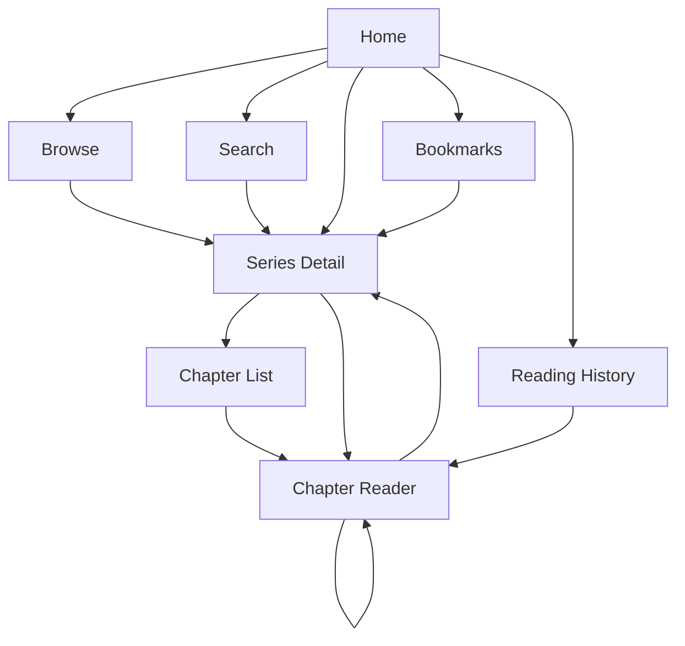

# Reader Wireframes

## 1. Overview

This document defines the wireframes and page structure for the Reader side of the Manga / Manhwa / Manhua Reader & CMS.

The wireframes focus on:

* Page structure
* Content placement
* Navigation
* User interaction
* Information hierarchy
* Reader experience

The wireframes are intentionally low-fidelity and focus on functionality rather than final visual styling.

---

# 2. Reader Navigation Structure

The Reader platform contains the following main pages:

```text
Reader
│
├── Home
│
├── Browse
│   ├── All
│   ├── Manga
│   ├── Manhwa
│   └── Manhua
│
├── Search
│
├── Series Detail
│   └── Chapter List
│
├── Chapter Reader
│
├── Bookmarks
│
├── Reading History
│
├── Login
│
└── Register
```

---

# 3. Global Layout

The Reader interface uses a consistent navigation structure.

```text
┌──────────────────────────────────────────────────────────────┐
│ LOGO          Home   Browse   Search          Login / Profile│
├──────────────────────────────────────────────────────────────┤
│                                                              │
│                       PAGE CONTENT                           │
│                                                              │
│                                                              │
└──────────────────────────────────────────────────────────────┘
```

## 3.1 Header

The header contains:

* Website logo/name
* Home navigation
* Browse navigation
* Search
* Login button for unauthenticated users
* Profile/menu for authenticated users

Example:

```text
┌──────────────────────────────────────────────────────────────┐
│ MangaReader   Home   Browse   Search       Login             │
└──────────────────────────────────────────────────────────────┘
```

Authenticated state:

```text
┌──────────────────────────────────────────────────────────────┐
│ MangaReader   Home   Browse   Search       Aldo ▼            │
└──────────────────────────────────────────────────────────────┘
```

---

# 4. Home Page

## 4.1 Purpose

The Home page is the main discovery page for readers.

It provides access to:

* Recently Added Series
* Recently Updated Series
* Latest Chapters
* Popular navigation categories
* Search

---

## 4.2 Wireframe

```text
┌──────────────────────────────────────────────────────────────┐
│ LOGO        Home   Browse   Search                 Login      │
├──────────────────────────────────────────────────────────────┤
│                                                              │
│                 MANGA / MANHWA / MANHUA                      │
│                                                              │
│          Read your favorite series online                    │
│                                                              │
│          ┌──────────────────────────────────────┐             │
│          │ Search series...                 🔍 │             │
│          └──────────────────────────────────────┘             │
│                                                              │
├──────────────────────────────────────────────────────────────┤
│ Recently Updated                              View All →     │
│                                                              │
│ ┌────────┐ ┌────────┐ ┌────────┐ ┌────────┐                 │
│ │ Cover  │ │ Cover  │ │ Cover  │ │ Cover  │                 │
│ │        │ │        │ │        │ │        │                 │
│ └────────┘ └────────┘ └────────┘ └────────┘                 │
│ Series A   Series B   Series C   Series D                    │
│ Ch. 20     Ch. 15     Ch. 31     Ch. 8                      │
│                                                              │
├──────────────────────────────────────────────────────────────┤
│ Recently Added                                 View All →     │
│                                                              │
│ ┌────────┐ ┌────────┐ ┌────────┐ ┌────────┐                 │
│ │ Cover  │ │ Cover  │ │ Cover  │ │ Cover  │                 │
│ └────────┘ └────────┘ └────────┘ └────────┘                 │
│ Series E   Series F   Series G   Series H                    │
│                                                              │
├──────────────────────────────────────────────────────────────┤
│ Latest Chapters                               View All →     │
│                                                              │
│ Series A        Chapter 20        Recently                   │
│ Series B        Chapter 15        Recently                   │
│ Series C        Chapter 31        Recently                   │
│                                                              │
└──────────────────────────────────────────────────────────────┘
```

---

## 4.3 Home Page Components

### Hero / Search Section

Contains:

* Main title
* Short description
* Search input

### Recently Updated

Displays series ordered by the publication date of their latest published chapter.

Example:

```text
Solo Leveling
Chapter 215
Updated 10 minutes ago
```

### Recently Added

Displays series ordered by:

```text
series.created_at DESC
```

### Latest Chapters

Displays recently published chapters across all series.

---

# 5. Browse Page

## 5.1 Purpose

The Browse page allows users to discover series by content type and genre.

---

## 5.2 Wireframe

```text
┌──────────────────────────────────────────────────────────────┐
│ LOGO        Home   Browse   Search                 Login      │
├──────────────────────────────────────────────────────────────┤
│                                                              │
│ Browse Series                                                │
│                                                              │
│ Content Type:                                                │
│ [ All ] [ Manga ] [ Manhwa ] [ Manhua ]                     │
│                                                              │
│ Genre:                                                       │
│ [ All Genres ▼ ]                                             │
│                                                              │
│ Sort:                                                        │
│ [ Latest Added ▼ ]                                           │
│                                                              │
├──────────────────────────────────────────────────────────────┤
│                                                              │
│ ┌────────┐ ┌────────┐ ┌────────┐ ┌────────┐                 │
│ │ Cover  │ │ Cover  │ │ Cover  │ │ Cover  │                 │
│ └────────┘ └────────┘ └────────┘ └────────┘                 │
│ Series A   Series B   Series C   Series D                    │
│ Manhwa     Manga      Manhua     Manhwa                      │
│                                                              │
│ ┌────────┐ ┌────────┐ ┌────────┐ ┌────────┐                 │
│ │ Cover  │ │ Cover  │ │ Cover  │ │ Cover  │                 │
│ └────────┘ └────────┘ └────────┘ └────────┘                 │
│ Series E   Series F   Series G   Series H                    │
│                                                              │
│                    1  2  3  4  Next →                       │
│                                                              │
└──────────────────────────────────────────────────────────────┘
```

---

## 5.3 Filters

The Browse page supports:

### Content Type

```text
All
Manga
Manhwa
Manhua
```

### Genre

```text
All
Action
Adventure
Comedy
Drama
Fantasy
Romance
...
```

### Sort

```text
Latest Added
Latest Updated
```

---

# 6. Search Page

## 6.1 Purpose

The Search page allows readers to find series by title.

---

## 6.2 Wireframe

```text
┌──────────────────────────────────────────────────────────────┐
│ LOGO        Home   Browse   Search                 Login      │
├──────────────────────────────────────────────────────────────┤
│                                                              │
│ Search Series                                                │
│                                                              │
│ ┌────────────────────────────────────────────┐ ┌───────────┐ │
│ │ Search by title...                         │ │  Search   │ │
│ └────────────────────────────────────────────┘ └───────────┘ │
│                                                              │
│ Filters:                                                     │
│ Content Type [All ▼]     Genre [All ▼]                       │
│                                                              │
├──────────────────────────────────────────────────────────────┤
│ Search Results                                                │
│                                                              │
│ ┌────────┐  Solo Leveling                                  │
│ │ Cover  │  Manhwa                                         │
│ │        │  Action, Fantasy                                │
│ └────────┘                                                  │
│                                                              │
│ ┌────────┐  Solo Max-Level Newbie                           │
│ │ Cover  │  Manhwa                                         │
│ │        │  Action, Fantasy                                │
│ └────────┘                                                  │
│                                                              │
└──────────────────────────────────────────────────────────────┘
```

---

# 7. Series Detail Page

## 7.1 Purpose

The Series Detail page displays complete information about a series and provides access to its chapters.

---

## 7.2 Wireframe

```text
┌──────────────────────────────────────────────────────────────┐
│ LOGO        Home   Browse   Search                 Login      │
├──────────────────────────────────────────────────────────────┤
│                                                              │
│ ┌──────────────┐                                             │
│ │              │    Solo Leveling                            │
│ │    COVER     │    Manhwa                                   │
│ │              │    Action • Adventure • Fantasy              │
│ └──────────────┘                                             │
│                                                              │
│                   [ Read First Chapter ]                     │
│                   [ Bookmark ]                               │
│                                                              │
│ Description                                                  │
│ ──────────────────────────────────────────────────────────── │
│ A short description of the series goes here.                 │
│                                                              │
├──────────────────────────────────────────────────────────────┤
│ Chapters                                                     │
│                                                              │
│ Search chapters...                                           │
│                                                              │
│ Chapter 215                                      Read →      │
│ Chapter 214                                      Read →      │
│ Chapter 213                                      Read →      │
│ Chapter 212                                      Read →      │
│ Chapter 211                                      Read →      │
│                                                              │
└──────────────────────────────────────────────────────────────┘
```

---

## 7.3 Series Information

The page displays:

* Cover
* Title
* Content type
* Genres
* Description
* Chapter count
* Bookmark action
* Chapter list

---

## 7.4 Chapter List

Chapters should normally be ordered:

```text
Newest
  ↓
Oldest
```

Example:

```text
Chapter 215
Chapter 214
Chapter 213
Chapter 212
...
Chapter 1
```

---

# 8. Chapter Reader Page

## 8.1 Purpose

The Chapter Reader is the main reading interface.

It displays chapter pages and provides navigation between pages and chapters.

---

## 8.2 Reader Wireframe

```text
┌──────────────────────────────────────────────────────────────┐
│ ← Back       Solo Leveling - Chapter 215          ☰         │
├──────────────────────────────────────────────────────────────┤
│                                                              │
│                         Page 1                               │
│                  ┌────────────────────┐                      │
│                  │                    │                      │
│                  │                    │                      │
│                  │    CHAPTER PAGE    │                      │
│                  │                    │                      │
│                  │                    │                      │
│                  └────────────────────┘                      │
│                                                              │
│                         Page 2                               │
│                  ┌────────────────────┐                      │
│                  │                    │                      │
│                  │    CHAPTER PAGE    │                      │
│                  │                    │                      │
│                  └────────────────────┘                      │
│                                                              │
│                         ...                                  │
│                                                              │
├──────────────────────────────────────────────────────────────┤
│                                                              │
│        ← Previous Chapter     Chapter List     Next Chapter →│
│                                                              │
└──────────────────────────────────────────────────────────────┘
```

---

# 9. Reader Controls

The Chapter Reader provides:

```text
┌──────────────────────────────────────────────────────────────┐
│ ← Previous     Chapter List     Next →                       │
└──────────────────────────────────────────────────────────────┘
```

The reader can:

* Scroll through chapter pages
* Return to chapter list
* Open previous chapter
* Open next chapter
* Return to series detail

---

# 10. Reading Progress

The system records reading progress through `READING_HISTORY`.

Example:

```text
User
  ↓
Solo Leveling
  ↓
Chapter 215
  ↓
Last Page: 17
```

The system can later display:

```text
Continue Reading

Solo Leveling
Chapter 215
Continue from page 17
```

---

# 11. Continue Reading

## 11.1 Wireframe

The Continue Reading component can appear on the Home page.

```text
┌──────────────────────────────────────────────────────────────┐
│ Continue Reading                                             │
│                                                              │
│ ┌────────┐  Solo Leveling                                   │
│ │ Cover  │  Chapter 215                                     │
│ │        │  Page 17                                         │
│ └────────┘  [ Continue Reading ]                            │
│                                                              │
└──────────────────────────────────────────────────────────────┘
```

This feature uses the user's reading history.

---

# 12. Bookmark Page

## 12.1 Purpose

The Bookmark page displays series saved by the user.

---

## 12.2 Wireframe

```text
┌──────────────────────────────────────────────────────────────┐
│ LOGO        Home   Browse   Search                 Profile ▼ │
├──────────────────────────────────────────────────────────────┤
│                                                              │
│ My Bookmarks                                                 │
│                                                              │
│ ┌────────┐ ┌────────┐ ┌────────┐ ┌────────┐                 │
│ │ Cover  │ │ Cover  │ │ Cover  │ │ Cover  │                 │
│ └────────┘ └────────┘ └────────┘ └────────┘                 │
│ Series A   Series B   Series C   Series D                    │
│                                                              │
│ [Remove]   [Remove]   [Remove]   [Remove]                   │
│                                                              │
└──────────────────────────────────────────────────────────────┘
```

---

# 13. Reading History Page

## 13.1 Purpose

The Reading History page displays chapters previously opened by the user.

---

## 13.2 Wireframe

```text
┌──────────────────────────────────────────────────────────────┐
│ LOGO        Home   Browse   Search                 Profile ▼ │
├──────────────────────────────────────────────────────────────┤
│                                                              │
│ Reading History                                              │
│                                                              │
│ Solo Leveling                                                │
│ Chapter 215                         Page 17        Continue  │
│                                                              │
│ Omniscient Reader                                            │
│ Chapter 180                         Page 4         Continue  │
│                                                              │
│ Tower of God                                                 │
│ Chapter 620                         Page 12        Continue  │
│                                                              │
└──────────────────────────────────────────────────────────────┘
```

---

# 14. Login Page

## 14.1 Wireframe

```text
┌──────────────────────────────────────────────────────────────┐
│                         LOGO                                 │
│                                                              │
│                         Login                                │
│                                                              │
│ Email                                                        │
│ ┌────────────────────────────────────────────┐               │
│ │                                            │               │
│ └────────────────────────────────────────────┘               │
│                                                              │
│ Password                                                     │
│ ┌────────────────────────────────────────────┐               │
│ │                                            │               │
│ └────────────────────────────────────────────┘               │
│                                                              │
│                  [ Login ]                                   │
│                                                              │
│              Don't have an account?                          │
│                    Register                                  │
│                                                              │
└──────────────────────────────────────────────────────────────┘
```

---

# 15. Register Page

## 15.1 Wireframe

```text
┌──────────────────────────────────────────────────────────────┐
│                         LOGO                                 │
│                                                              │
│                       Register                               │
│                                                              │
│ Username                                                     │
│ ┌────────────────────────────────────────────┐               │
│ │                                            │               │
│ └────────────────────────────────────────────┘               │
│                                                              │
│ Email                                                        │
│ ┌────────────────────────────────────────────┐               │
│ │                                            │               │
│ └────────────────────────────────────────────┘               │
│                                                              │
│ Password                                                     │
│ ┌────────────────────────────────────────────┐               │
│ │                                            │               │
│ └────────────────────────────────────────────┘               │
│                                                              │
│ Confirm Password                                             │
│ ┌────────────────────────────────────────────┐               │
│ │                                            │               │
│ └────────────────────────────────────────────┘               │
│                                                              │
│                  [ Register ]                                │
│                                                              │
│                 Already registered?                         │
│                       Login                                  │
│                                                              │
└──────────────────────────────────────────────────────────────┘
```

---

# 16. User Navigation

Authenticated users can access:

```text
Profile Menu
│
├── Bookmarks
├── Reading History
└── Logout
```

Example:

```text
┌─────────────────────────┐
│ Aldo                    │
├─────────────────────────┤
│ Bookmarks               │
│ Reading History         │
│ Logout                  │
└─────────────────────────┘
```

---

# 17. Chapter Comments

Comments are displayed below the chapter content or through a dedicated comments section.

```text
┌──────────────────────────────────────────────────────────────┐
│ Chapter 215                                                 │
│                                                              │
│ [ Chapter Pages ]                                            │
│                                                              │
├──────────────────────────────────────────────────────────────┤
│ Comments                                                     │
│                                                              │
│ Aldo                                                         │
│ "This chapter was great."                                    │
│                                                              │
│ User123                                                      │
│ "The next chapter should be interesting."                    │
│                                                              │
│ ┌────────────────────────────────────────────┐               │
│ │ Write a comment...                        │               │
│ └────────────────────────────────────────────┘               │
│                                                              │
│                    [ Submit ]                                │
│                                                              │
└──────────────────────────────────────────────────────────────┘
```

Unauthenticated users should be prompted to log in before commenting.

---

# 18. Empty States

The interface should provide useful messages when no data is available.

## No Search Results

```text
┌──────────────────────────────────────────┐
│                                          │
│          No series found.                │
│                                          │
│ Try another search term or filter.      │
│                                          │
└──────────────────────────────────────────┘
```

## No Bookmarks

```text
┌──────────────────────────────────────────┐
│                                          │
│          No bookmarks yet.               │
│                                          │
│      Browse series to add one.           │
│                                          │
└──────────────────────────────────────────┘
```

## No Reading History

```text
┌──────────────────────────────────────────┐
│                                          │
│       No reading history yet.            │
│                                          │
│        Start reading a series.           │
│                                          │
└──────────────────────────────────────────┘
```

---

# 19. Loading States

Pages should provide loading feedback while data is being retrieved.

Example:

```text
┌────────┐ ┌────────┐ ┌────────┐
│ Loading│ │ Loading│ │ Loading│
│        │ │        │ │        │
└────────┘ └────────┘ └────────┘
```

For the Chapter Reader:

```text
Loading chapter...
```

---

# 20. Error States

If a request fails, the interface should provide a clear error message.

Example:

```text
┌──────────────────────────────────────────┐
│                                          │
│       Failed to load series.             │
│                                          │
│             [ Try Again ]                │
│                                          │
└──────────────────────────────────────────┘
```

---

# 21. Responsive Layout

The Reader interface should support:

* Desktop
* Tablet
* Mobile

## Desktop

```text
┌──────────────────────────────────────────────────────────┐
│ Header                                                    │
├──────────────────────────────────────────────────────────┤
│                                                          │
│                 Main Content                             │
│                                                          │
└──────────────────────────────────────────────────────────┘
```

## Mobile

```text
┌───────────────────────┐
│ LOGO              ☰   │
├───────────────────────┤
│                       │
│     Main Content      │
│                       │
│                       │
└───────────────────────┘
```

Navigation may collapse into a mobile menu.

---

# 22. Reader Page Flow

The main reader journey is:



---

# 23. Main User Journey

The primary reading flow is:

```text
Home
  ↓
Browse / Search
  ↓
Series Detail
  ↓
Chapter List
  ↓
Chapter Reader
  ↓
Read Pages
  ↓
Reading History
  ↓
Continue Reading
```

---

# 24. Content Discovery Flow

```text
Home
  │
  ├── Recently Updated
  │       ↓
  │   Series Detail
  │
  ├── Recently Added
  │       ↓
  │   Series Detail
  │
  └── Search
          ↓
      Search Results
          ↓
      Series Detail
```

---

# 25. Wireframe Design Principles

The Reader UI should follow these principles:

### Simple Navigation

Users should be able to reach major sections quickly.

### Content First

Series covers, titles, chapters, and reading content should remain the primary visual focus.

### Consistent Layout

Common components such as headers, cards, buttons, and navigation should use consistent positioning and behavior.

### Clear Actions

Important actions should be visually distinguishable.

Examples:

```text
Read Chapter
Continue Reading
Bookmark
Next Chapter
Previous Chapter
```

### Responsive Design

The layout should remain usable on smaller screens.

### Accessible Interaction

Interactive elements should have clear labels and sufficient clickable areas.

---

# 26. MVP Screen Checklist

## Public Reader

* [x] Home
* [x] Browse
* [x] Search
* [x] Series Detail
* [x] Chapter List
* [x] Chapter Reader
* [x] Login
* [x] Register

## Authenticated Reader

* [x] Bookmarks
* [x] Reading History
* [x] Continue Reading
* [x] Chapter Comments

## UI States

* [x] Loading
* [x] Empty
* [x] Error
* [x] Responsive layout

---

# 27. Future UI Considerations

The following features are outside the initial MVP but can be added later:

* User profile page
* Rating system
* Notifications
* Followed series
* Advanced search
* Multiple languages
* Personalized recommendations
* Reading preferences
* Dark/light theme
* Advanced reader settings

---

# 28. Related Documentation

* [SRS](../../docs/SRS.md)
* [Use Case Documentation](../../docs/use-case.md)
* [Activity Diagram](../../docs/activity-diagram.md)
* [Sequence Diagram](../../docs/sequence-diagram.md)
* [Database / ERD](../../docs/database.md)
* [System Architecture](../../docs/architecture.md)

---

# 29. Completion Criteria

The Reader wireframe documentation is considered complete when:

* [x] Reader navigation is defined
* [x] Home page is defined
* [x] Browse page is defined
* [x] Search page is defined
* [x] Series Detail page is defined
* [x] Chapter Reader is defined
* [x] Bookmark page is defined
* [x] Reading History is defined
* [x] Login page is defined
* [x] Register page is defined
* [x] Chapter comments are defined
* [x] Loading states are defined
* [x] Empty states are defined
* [x] Error states are defined
* [x] Responsive layout is considered
* [x] Main Reader user flows are documented

---

# 30. Summary

The Reader wireframes define the main user-facing pages and navigation flow for the Manga / Manhwa / Manhua Reader & CMS.

The primary flow is:

```text
Home
 ↓
Browse / Search
 ↓
Series Detail
 ↓
Chapter List
 ↓
Chapter Reader
```

Authenticated users additionally have:

```text
Bookmarks
Reading History
Continue Reading
Comments
```

These wireframes provide the structural foundation for the visual UI design and frontend implementation.