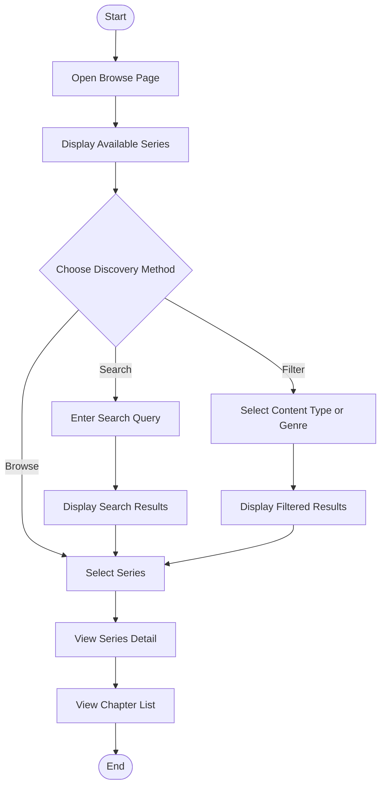
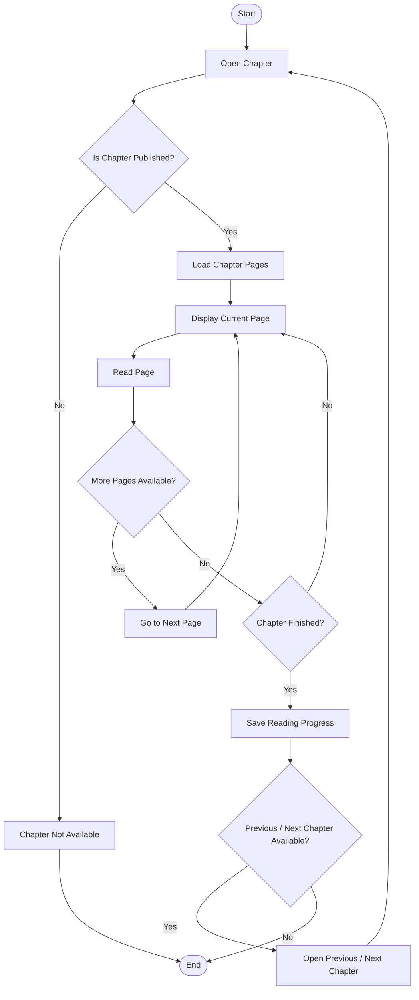
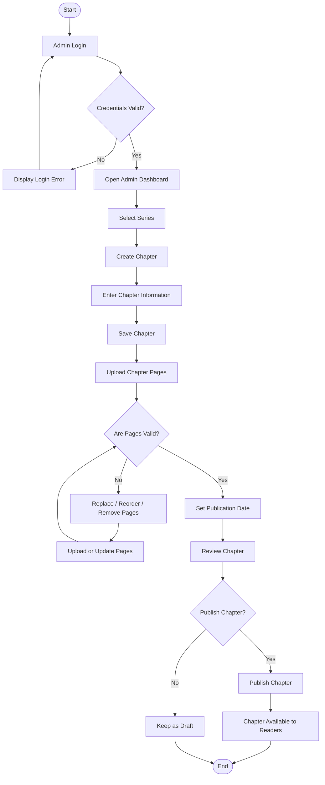

# Activity Diagram

## Manga / Manhwa / Manhua Reader & CMS

---

## 1. Overview

The Activity Diagram describes the workflow of important processes within the Manga / Manhwa / Manhua Reader & CMS.

The diagrams focus on the main workflows performed by the Reader and Admin.

This document contains the following activity diagrams:

1. Reader discovers and opens a series
2. Reader reads a chapter
3. Admin creates and publishes a chapter

---

## 2. Reader Discovers and Opens a Series

### 2.1 Description

This activity describes the process of a Reader discovering a manga, manhwa, or manhua and opening its series details.

### 2.2 Activity Flow

### 2.3 Main Flow

1. Reader opens the Browse page.
2. System displays available series.
3. Reader chooses how to discover content.
4. Reader may:
   - Browse available series.
   - Search for a series.
   - Filter series by content type or genre.
5. System displays the appropriate results.
6. Reader selects a series.
7. System displays the series details.
8. Reader views the chapter list.
9. The activity ends.

---

## 3. Reader Reads a Chapter

### 3.1 Description

This activity describes the process of a Reader opening and reading a published chapter.

The Reader can navigate through chapter pages and move to the previous or next chapter when available.

### 3.2 Activity Flow

### 3.3 Main Flow

1. Reader opens a chapter.
2. System verifies the chapter publication status.
3. If the chapter is not published, the system does not allow the Reader to access it.
4. If the chapter is published, the system retrieves the chapter pages.
5. System displays the current page.
6. Reader reads the page.
7. Reader continues navigating through the chapter pages.
8. When the chapter is finished, the system saves the reading progress.
9. System checks whether a previous or next chapter is available.
10. If another chapter is selected, the Reader opens that chapter.
11. If no chapter is selected, the activity ends.

---

## 4. Admin Creates and Publishes a Chapter

### 4.1 Description

This activity describes the process of an Admin creating a chapter, uploading its pages, configuring the publication information, and publishing the chapter.

### 4.2 Activity Flow

### 4.3 Main Flow

1. Admin opens the Admin CMS.
2. Admin logs in.
3. System validates the administrator credentials.
4. If authentication fails, the system displays an error and the Admin may retry.
5. If authentication succeeds, the Admin enters the dashboard.
6. Admin selects the target series.
7. Admin creates a new chapter.
8. Admin enters chapter information.
9. Admin saves the chapter.
10. Admin uploads the chapter pages.
11. System validates the uploaded pages.
12. If the pages are invalid, the Admin can replace, reorder, remove, or upload the pages again.
13. If the pages are valid, the Admin sets the publication date.
14. Admin reviews the chapter.
15. Admin decides whether to publish the chapter.
16. If the chapter is published, it becomes available to Readers.
17. If the Admin does not publish the chapter, it remains unpublished/draft.
18. The activity ends.

---

## 5. Activity Diagram Summary

| Activity | Primary Actor | Main Result |
|---|---|---|
| Discover and Open Series | Reader | Reader reaches a series and its chapter list |
| Read Chapter | Reader | Reader reads a published chapter and reading progress can be stored |
| Create and Publish Chapter | Admin | A chapter is created and can become available to Readers |

---

## 6. Business Rules Represented

The activity diagrams follow these basic system rules:

1. Only published chapters can be read by Readers.
2. Chapter pages must be available before a chapter can be published.
3. Admin authentication is required to access the Admin CMS.
4. Reading progress may be stored when a Reader finishes or leaves a chapter.
5. Readers may navigate to another chapter when a previous or next chapter is available.
6. A chapter that is not published remains unavailable to Readers.
7. Series can be discovered through browsing, searching, or filtering.
8. Chapter publication is controlled by the Admin.

---

## 7. Related Documentation

- [Software Requirements Specification](SRS.md)
- [Use Case Documentation](use-case.md)
- Database / ERD documentation
- Sequence Diagram documentation
- System Architecture documentation

---

## 8. Activity Diagram Completion Criteria

The Activity Diagram documentation is considered complete when:

- The main Reader discovery workflow is documented.
- The Reader chapter-reading workflow is documented.
- The Admin chapter-management and publication workflow is documented.
- Each workflow has a visual activity diagram.
- Major decision points are represented.
- The documented workflows are consistent with the SRS and Use Case documentation.