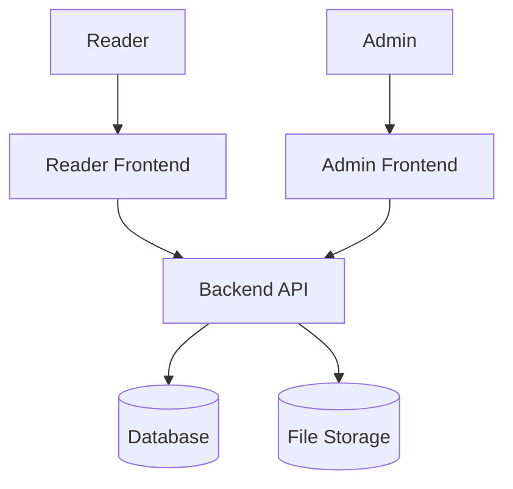
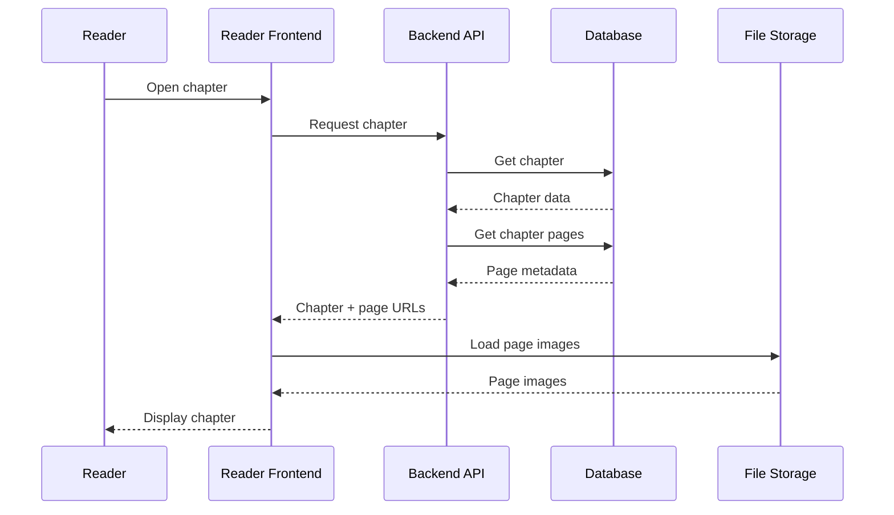
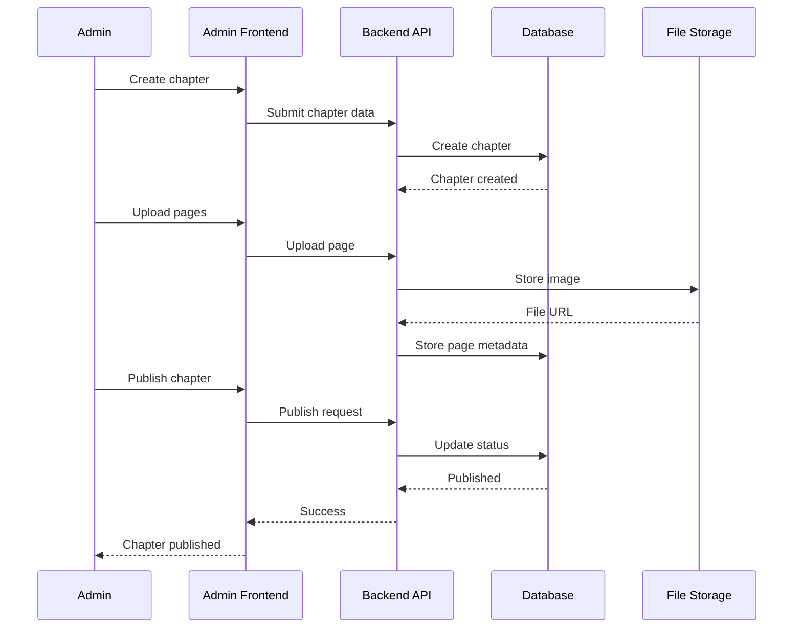

# System Architecture

## 1. Overview

The Manga / Manhwa / Manhua Reader & CMS uses a layered client-server architecture.

The system is divided into:

* Reader Frontend
* Admin Frontend
* Backend API
* Database
* File Storage

The architecture separates the user interface, business logic, data management, and content storage so that each component can be developed and maintained independently.

---

## 2. High-Level Architecture



### Components

| Component       | Responsibility                           |
| --------------- | ---------------------------------------- |
| Reader          | Reads and interacts with content         |
| Admin           | Manages content and users                |
| Reader Frontend | Reader-facing web interface              |
| Admin Frontend  | CMS interface                            |
| Backend API     | Business logic and request processing    |
| Database        | Stores structured application data       |
| File Storage    | Stores chapter pages and uploaded images |

---

## 3. Architecture Layers

The system follows a layered architecture.

```text
┌─────────────────────────────┐
│        Presentation         │
│                             │
│  Reader Frontend            │
│  Admin Frontend             │
└──────────────┬──────────────┘
               │
               │ HTTP / API
               ▼
┌─────────────────────────────┐
│       Application Layer     │
│                             │
│  Authentication             │
│  Series Management          │
│  Chapter Management         │
│  Reading Logic              │
│  Bookmark Logic             │
│  History Logic              │
│  Comment Logic              │
└──────────────┬──────────────┘
               │
               ▼
┌─────────────────────────────┐
│          Data Layer         │
│                             │
│  Database                   │
│  File Storage               │
└─────────────────────────────┘
```

---

## 4. Reader Frontend

The Reader Frontend is the public-facing interface used by readers.

### Main Responsibilities

* Register
* Login
* Logout
* Browse series
* Search series
* Filter series
* View series details
* View chapter lists
* Read chapters
* Navigate chapter pages
* Navigate between chapters
* Bookmark series
* View bookmarks
* View reading history
* Continue reading
* Comment on chapters

### Main Screens

```text
Reader Frontend

├── Home
├── Browse
├── Search
├── Login
├── Register
├── Series Detail
├── Chapter List
├── Reader
├── Bookmarks
├── Reading History
└── User Account
```

---

## 5. Admin Frontend

The Admin Frontend provides the CMS interface for administrators.

### Main Responsibilities

* Admin login
* View dashboard
* Manage series
* Manage genres
* Manage chapters
* Upload chapter pages
* Publish/unpublish chapters
* Manage users
* Moderate comments

### Main Screens

```text
Admin Frontend

├── Login
├── Dashboard
├── Series Management
│   ├── Series List
│   ├── Create Series
│   └── Edit Series
│
├── Genre Management
│   ├── Genre List
│   ├── Create Genre
│   └── Edit Genre
│
├── Chapter Management
│   ├── Chapter List
│   ├── Create Chapter
│   ├── Edit Chapter
│   └── Page Management
│
├── User Management
└── Comment Moderation
```

---

## 6. Backend API

The Backend API is responsible for processing requests from both frontends.

### Main Responsibilities

* Authentication
* Authorization
* Request validation
* Business logic
* Series management
* Chapter management
* Content ordering
* Bookmark management
* Reading history
* Comment management
* User management
* Database communication
* File upload handling

The backend acts as the central application layer between the frontends and data sources.

---

## 7. API Communication

The frontends communicate with the backend using HTTP requests.

Example:

```text
Reader Frontend
      │
      │ GET /api/series
      ▼
Backend API
      │
      │ Query
      ▼
Database
      │
      │ Series data
      ▼
Backend API
      │
      │ JSON response
      ▼
Reader Frontend
```

Example response:

```json
{
  "id": "series-001",
  "title": "Example Series",
  "content_type": "Manhwa",
  "cover_url": "/covers/example.jpg"
}
```

---

## 8. Authentication and Authorization

Authentication verifies the identity of a user.

Authorization determines what the user is allowed to do.

```text
User
 │
 │ Login
 ▼
Backend API
 │
 │ Verify credentials
 ▼
Database
 │
 │ User + Role
 ▼
Backend API
 │
 ├── Reader → Reader permissions
 │
 └── Admin  → Admin permissions
```

### Reader

Readers can:

* Browse content
* Read published chapters
* Manage bookmarks
* View reading history
* Comment

### Admin

Admins can:

* Manage series
* Manage genres
* Manage chapters
* Upload pages
* Publish chapters
* Manage users
* Moderate comments

---

## 9. Content Management Architecture

Content is divided between structured data and image files.

### Structured Data

Stored in the database:

```text
Series
Chapter
Chapter Page metadata
Genre
Content Type
User
Bookmark
Reading History
Comment
```

### Image Files

Stored in file storage:

```text
Series Covers
Chapter Pages
```

The database stores references to these files instead of storing the actual image files directly.

Example:

```text
Database

CHAPTER_PAGE
┌──────────┬───────────────┬─────────────┐
│ id       │ chapter_id    │ image_url   │
├──────────┼───────────────┼─────────────┤
│ page-001 │ chapter-001   │ /pages/001  │
│ page-002 │ chapter-001   │ /pages/002  │
└──────────┴───────────────┴─────────────┘
```

---

## 10. Chapter Reading Flow



Only published chapters should be available through the public reader.

---

## 11. Admin Publishing Flow



---

## 12. Recently Updated Logic

The system distinguishes between:

* Recently Added
* Recently Updated

### Recently Added

Based on:

```text
series.created_at
```

Example:

```text
Series A → created 2026-09-20
Series B → created 2026-09-25
Series C → created 2026-09-27
```

Recently Added:

```text
Series C
Series B
Series A
```

### Recently Updated

Based on the latest published chapter.

```text
Series A
 └── Chapter 10 → 2026-09-10

Series B
 └── Chapter 25 → 2026-09-27

Series C
 └── Chapter 5 → 2026-09-20
```

Recently Updated:

```text
Series B
Series C
Series A
```

Therefore, an old series can appear near the top when it receives a new published chapter.

---

## 13. Database Interaction

The backend communicates with the database for structured application data.

```text
Backend API
     │
     ├── User data
     ├── Series data
     ├── Genre data
     ├── Chapter data
     ├── Bookmark data
     ├── Reading history
     └── Comment data
             │
             ▼
         Database
```

The frontend should not directly access the database.

Correct:

```text
Frontend → Backend → Database
```

Incorrect:

```text
Frontend → Database
```

---

## 14. File Storage Interaction

Chapter images and series covers are handled separately from normal database records.

```text
Admin
  │
  ▼
Admin Frontend
  │
  ▼
Backend API
  │
  ├──────────────► Database
  │
  └──────────────► File Storage
```

The database stores file references such as:

```text
/covers/solo-leveling.jpg
/pages/chapter-001/page-001.jpg
```

The actual image files are stored in the file storage system.

---

## 15. Security Considerations

The system should implement the following security measures:

### Authentication

* Passwords must not be stored as plain text.
* Passwords should be securely hashed.
* Authentication credentials should be handled securely.

### Authorization

Admin endpoints must require administrator privileges.

Example:

```text
Reader
  │
  └── GET /api/series
       ✓ Allowed

Reader
  │
  └── POST /api/admin/series
       ✗ Forbidden
```

### Input Validation

User input should be validated before being processed.

Examples:

* Email format
* Username
* Password
* Chapter number
* Comment content
* Uploaded file type
* Uploaded file size

### File Upload Security

Uploaded images should be validated for:

* File type
* File size
* File extension
* Upload permissions

---

## 16. Scalability Considerations

The architecture should allow individual components to be improved without redesigning the entire system.

Potential future improvements:

```text
Current

Frontend
    │
Backend
    │
Database
    │
File Storage
```

Future:

```text
                    ┌── Reader Frontend
                    │
Users ──────────────┼── Admin Frontend
                    │
                    ▼
                Backend API
                    │
          ┌─────────┴─────────┐
          ▼                   ▼
      Database           File Storage
          │                   │
          └─────────┬─────────┘
                    ▼
                 Cache/CDN
```

Possible future technologies include:

* Caching
* CDN
* Object storage
* Database indexing
* Load balancing
* Containerization

These are architectural considerations and are not required for the initial MVP.

---

## 17. Technology Independence

The architecture intentionally does not require a specific technology stack at this stage.

The following components can be implemented using different technologies:

| Component       | Possible Technology               |
| --------------- | --------------------------------- |
| Reader Frontend | React / Next.js                   |
| Admin Frontend  | React / Next.js                   |
| Backend         | Go / Node.js / Java               |
| Database        | PostgreSQL / MySQL                |
| File Storage    | Object Storage / Local Storage    |
| Deployment      | VPS / Cloud Platform / Containers |

The final technology choices should be defined during implementation planning.

---

## 18. Architecture Principles

The system follows these principles:

### Separation of Concerns

Each component has a specific responsibility.

### API-Based Communication

Frontends communicate with the backend through defined APIs.

### Database Abstraction

Frontends do not directly access the database.

### Independent File Storage

Large image files are separated from structured database records.

### Role-Based Access

Reader and Admin permissions are separated.

### Extensibility

The architecture should support future features without requiring a complete redesign.

---

## 19. MVP Architecture

For the MVP, the architecture can remain relatively simple:

```text
             ┌──────────────────┐
             │  Reader Frontend  │
             └────────┬─────────┘
                      │
                      │
             ┌────────▼─────────┐
             │   Backend API    │
             └──────┬─────┬─────┘
                    │     │
             ┌──────▼─┐ ┌─▼────────────┐
             │Database│ │ File Storage │
             └────────┘ └──────────────┘
                    ▲
                    │
             ┌──────┴─────────┐
             │ Admin Frontend │
             └────────────────┘
```

The MVP does not require:

* Microservices
* Kubernetes
* Load balancing
* Distributed databases
* Complex caching systems
* AI recommendation services
* Real-time messaging infrastructure

These can be considered later if system requirements justify them.

---

## 20. Related Documentation

* [SRS](SRS.md)
* [Use Case Documentation](use-case.md)
* [Activity Diagram](activity-diagram.md)
* [Sequence Diagram](sequence-diagram.md)
* [Database / ERD](database.md)

---

## 21. Completion Criteria

The System Architecture documentation is considered complete when:

* [x] Major system components are identified
* [x] Reader Frontend is defined
* [x] Admin Frontend is defined
* [x] Backend API is defined
* [x] Database is defined
* [x] File Storage is defined
* [x] Component communication is documented
* [x] Authentication and authorization boundaries are documented
* [x] Content management flow is documented
* [x] Reading flow is documented
* [x] Recently Updated logic is documented
* [x] MVP architecture is defined
* [x] Future scalability considerations are documented
* [x] Technology choices remain flexible until implementation planning

---

## 22. Summary

The Manga / Manhwa / Manhua Reader & CMS uses a client-server architecture consisting of:

```text
Reader Frontend
       │
       ▼
   Backend API
       │
   ┌───┴────┐
   ▼        ▼
Database  File Storage
   ▲
   │
Admin Frontend
```

The architecture separates presentation, application logic, structured data, and file storage while keeping the MVP simple enough to implement and allowing future expansion.