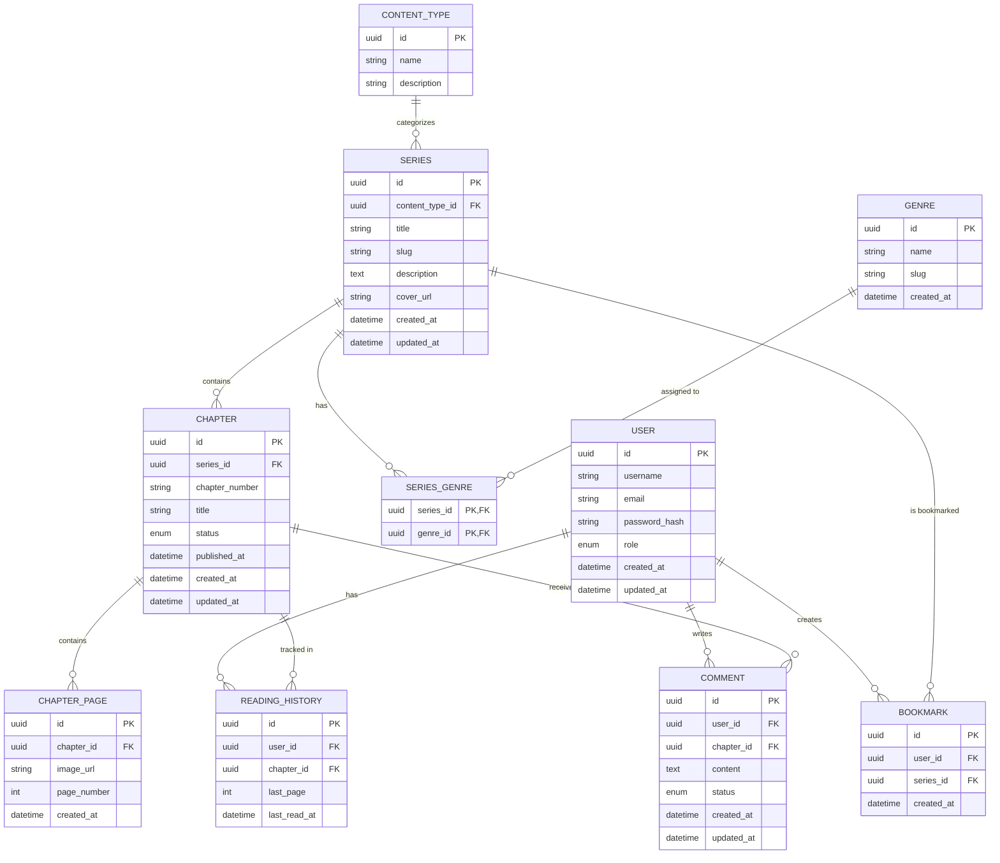

# Database Design & ERD

## Manga / Manhwa / Manhua Reader & CMS

---

## 1. Overview

This document defines the database structure for the Manga / Manhwa / Manhua Reader & CMS.

The database is designed to support:

- User authentication
- Manga, manhwa, and manhua management
- Genre management
- Chapter management
- Chapter page management
- Bookmarks
- Reading history
- Chapter comments
- Chapter publication status
- Content discovery and update ordering

The database uses a relational data model.

---

## 2. Database Entities

The initial database consists of the following entities:

| Entity | Purpose |
|---|---|
| User | Stores Reader and Admin accounts |
| Series | Stores manga, manhwa, and manhua information |
| Content Type | Defines whether a series is Manga, Manhwa, or Manhua |
| Genre | Stores available genres |
| Series Genre | Connects series with genres |
| Chapter | Stores chapters belonging to a series |
| Chapter Page | Stores pages belonging to a chapter |
| Bookmark | Stores bookmarked series for users |
| Reading History | Stores the user's reading progress |
| Comment | Stores comments submitted by users |

---

## 3. Entity Relationship Diagram



---

## 4. User

### 4.1 Purpose

The `User` entity stores account information for users of the platform.

Both Readers and Admins are represented by this entity.

### 4.2 Attributes

| Attribute | Type | Constraint | Description |
|---|---|---|---|
| id | UUID | PK | Unique user identifier |
| username | VARCHAR | NOT NULL, UNIQUE | User display name |
| email | VARCHAR | NOT NULL, UNIQUE | User email address |
| password_hash | VARCHAR | NOT NULL | Hashed password |
| role | ENUM | NOT NULL | User role |
| created_at | DATETIME | NOT NULL | Account creation time |
| updated_at | DATETIME | NOT NULL | Last account update time |

### 4.3 Role

The initial roles are:

```text
READER
ADMIN
```

A Reader can access the Reader Platform.

An Admin can access the Admin CMS.

---

## 5. Content Type

### 5.1 Purpose

The `Content Type` entity defines the type of a series.

### 5.2 Supported Content Types

```text
MANGA
MANHWA
MANHUA
```

### 5.3 Attributes

| Attribute | Type | Constraint | Description |
|---|---|---|---|
| id | UUID | PK | Unique content type identifier |
| name | VARCHAR | NOT NULL, UNIQUE | Content type name |
| description | VARCHAR | NULL | Content type description |

### 5.4 Relationship

One Content Type can belong to many Series.

```text
Content Type 1 ──────── N Series
```

---

## 6. Series

### 6.1 Purpose

The `Series` entity stores manga, manhwa, and manhua information.

A single `Series` entity is used for all three content types.

### 6.2 Attributes

| Attribute | Type | Constraint | Description |
|---|---|---|---|
| id | UUID | PK | Unique series identifier |
| content_type_id | UUID | FK, NOT NULL | References Content Type |
| title | VARCHAR | NOT NULL | Series title |
| slug | VARCHAR | NOT NULL, UNIQUE | URL-friendly identifier |
| description | TEXT | NULL | Series description |
| cover_url | VARCHAR | NULL | Series cover image location |
| created_at | DATETIME | NOT NULL | Series creation time |
| updated_at | DATETIME | NOT NULL | Last series update time |

### 6.3 Relationships

A Series belongs to one Content Type.

```text
Content Type 1 ──────── N Series
```

A Series can contain multiple Chapters.

```text
Series 1 ──────── N Chapter
```

A Series can have multiple Genres through `Series Genre`.

```text
Series N ──────── N Genre
```

---

## 7. Genre

### 7.1 Purpose

The `Genre` entity stores genres that can be assigned to Series.

### 7.2 Attributes

| Attribute | Type | Constraint | Description |
|---|---|---|---|
| id | UUID | PK | Unique genre identifier |
| name | VARCHAR | NOT NULL, UNIQUE | Genre name |
| slug | VARCHAR | NOT NULL, UNIQUE | URL-friendly identifier |
| created_at | DATETIME | NOT NULL | Genre creation time |

### 7.3 Relationship

A Series can have multiple Genres.

A Genre can be assigned to multiple Series.

Therefore, Series and Genre have a many-to-many relationship.

This relationship is implemented through `Series Genre`.

```text
Series N ──────── N Genre
```

---

## 8. Series Genre

### 8.1 Purpose

The `Series Genre` entity is a junction table that connects Series and Genre.

### 8.2 Attributes

| Attribute | Type | Constraint | Description |
|---|---|---|---|
| series_id | UUID | PK, FK | References Series |
| genre_id | UUID | PK, FK | References Genre |

### 8.3 Primary Key

The combination of:

```text
series_id + genre_id
```

forms the composite primary key.

This prevents the same genre from being assigned to the same series more than once.

---

## 9. Chapter

### 9.1 Purpose

The `Chapter` entity stores chapters belonging to a Series.

### 9.2 Attributes

| Attribute | Type | Constraint | Description |
|---|---|---|---|
| id | UUID | PK | Unique chapter identifier |
| series_id | UUID | FK, NOT NULL | References Series |
| chapter_number | VARCHAR | NOT NULL | Chapter number |
| title | VARCHAR | NULL | Chapter title |
| status | ENUM | NOT NULL | Publication status |
| published_at | DATETIME | NULL | Publication date and time |
| created_at | DATETIME | NOT NULL | Chapter creation time |
| updated_at | DATETIME | NOT NULL | Last chapter update time |

### 9.3 Chapter Status

The initial chapter states are:

```text
DRAFT
PUBLISHED
UNPUBLISHED
```

### 9.4 Relationships

A Series can contain many Chapters.

```text
Series 1 ──────── N Chapter
```

A Chapter can contain many Chapter Pages.

```text
Chapter 1 ──────── N Chapter Page
```

---

## 10. Chapter Page

### 10.1 Purpose

The `Chapter Page` entity stores individual image pages belonging to a Chapter.

### 10.2 Attributes

| Attribute | Type | Constraint | Description |
|---|---|---|---|
| id | UUID | PK | Unique page identifier |
| chapter_id | UUID | FK, NOT NULL | References Chapter |
| image_url | VARCHAR | NOT NULL | Page image location |
| page_number | INT | NOT NULL | Page ordering number |
| created_at | DATETIME | NOT NULL | Page creation time |

### 10.3 Page Ordering

Pages are displayed according to:

```text
page_number ASC
```

Example:

```text
Page 1
Page 2
Page 3
Page 4
...
```

The Admin can reorder pages by modifying their page numbers.

---

## 11. Bookmark

### 11.1 Purpose

The `Bookmark` entity stores Series bookmarked by a Reader.

### 11.2 Attributes

| Attribute | Type | Constraint | Description |
|---|---|---|---|
| id | UUID | PK | Unique bookmark identifier |
| user_id | UUID | FK, NOT NULL | References User |
| series_id | UUID | FK, NOT NULL | References Series |
| created_at | DATETIME | NOT NULL | Bookmark creation time |

### 11.3 Relationship

A User can bookmark multiple Series.

A Series can be bookmarked by multiple Users.

```text
User N ──────── N Series
       Bookmark
```

### 11.4 Duplicate Prevention

The combination:

```text
user_id + series_id
```

should be unique.

A user should not be able to bookmark the same series multiple times.

---

## 12. Reading History

### 12.1 Purpose

The `Reading History` entity stores the Reader's reading progress.

It allows the system to support:

- Reading history
- Continue Reading
- Last page tracking
- Recently read content

### 12.2 Attributes

| Attribute | Type | Constraint | Description |
|---|---|---|---|
| id | UUID | PK | Unique history identifier |
| user_id | UUID | FK, NOT NULL | References User |
| chapter_id | UUID | FK, NOT NULL | References Chapter |
| last_page | INT | NOT NULL | Last page read |
| last_read_at | DATETIME | NOT NULL | Last reading activity |

### 12.3 Relationship

A User can have reading history for multiple Chapters.

```text
User 1 ──────── N Reading History
```

A Chapter can appear in the reading history of multiple Users.

```text
Chapter 1 ──────── N Reading History
```

### 12.4 Continue Reading

The Continue Reading feature can retrieve the latest reading history entry based on:

```text
last_read_at DESC
```

The system can then open the corresponding chapter at:

```text
last_page
```

---

## 13. Comment

### 13.1 Purpose

The `Comment` entity stores comments submitted by Readers on Chapters.

### 13.2 Attributes

| Attribute | Type | Constraint | Description |
|---|---|---|---|
| id | UUID | PK | Unique comment identifier |
| user_id | UUID | FK, NOT NULL | References User |
| chapter_id | UUID | FK, NOT NULL | References Chapter |
| content | TEXT | NOT NULL | Comment content |
| status | ENUM | NOT NULL | Moderation status |
| created_at | DATETIME | NOT NULL | Comment creation time |
| updated_at | DATETIME | NOT NULL | Last comment update time |

### 13.3 Comment Status

The initial comment states are:

```text
VISIBLE
HIDDEN
DELETED
```

### 13.4 Relationships

A User can create multiple comments.

```text
User 1 ──────── N Comment
```

A Chapter can receive multiple comments.

```text
Chapter 1 ──────── N Comment
```

---

## 14. Relationship Summary

| Relationship | Cardinality | Implementation |
|---|---|---|
| Content Type → Series | 1 : N | `series.content_type_id` |
| Series → Chapter | 1 : N | `chapter.series_id` |
| Chapter → Chapter Page | 1 : N | `chapter_page.chapter_id` |
| Series ↔ Genre | N : N | `series_genre` |
| User ↔ Series | N : N | `bookmark` |
| User → Reading History | 1 : N | `reading_history.user_id` |
| Chapter → Reading History | 1 : N | `reading_history.chapter_id` |
| User → Comment | 1 : N | `comment.user_id` |
| Chapter → Comment | 1 : N | `comment.chapter_id` |

---

## 15. Content Ordering Logic

The database structure supports the content ordering requirements defined in the SRS.

### 15.1 Recently Added Series

Recently Added Series is based on:

```text
series.created_at DESC
```

The newest series appear first.

---

### 15.2 Recently Updated Series

Recently Updated Series is based on the latest published chapter associated with each series.

Conceptually:

```text
MAX(chapter.published_at)
```

for each Series where the Chapter is published.

The resulting Series are ordered by:

```text
latest_published_at DESC
```

This means an older Series can appear near the top when it receives a newly published chapter.

---

### 15.3 Latest Chapters

Latest Chapters are ordered using:

```text
chapter.published_at DESC
```

Only published chapters should appear in the Reader Platform.

---

## 16. Database Constraints

The database should enforce the following constraints.

### 16.1 User Constraints

- Email must be unique.
- Username must be unique.
- Password must be stored as a hash.
- Role must contain a valid supported role.

### 16.2 Series Constraints

- Series title is required.
- Series slug must be unique.
- Content type is required.
- A Series must reference an existing Content Type.

### 16.3 Genre Constraints

- Genre name must be unique.
- Genre slug must be unique.

### 16.4 Chapter Constraints

- Every Chapter must belong to a Series.
- Chapter status must be valid.
- A published Chapter should have a publication date.
- Unpublished or draft Chapters should not be displayed to Readers.

### 16.5 Chapter Page Constraints

- Every page must belong to a Chapter.
- Page number is required.
- Page ordering should be deterministic.

### 16.6 Bookmark Constraints

- A User cannot bookmark the same Series more than once.

### 16.7 Reading History Constraints

- Reading progress must reference an existing User.
- Reading progress must reference an existing Chapter.
- Last page must be a valid page position.

### 16.8 Comment Constraints

- Every Comment must belong to an existing User.
- Every Comment must belong to an existing Chapter.
- Comment content cannot be empty.
- Comment status must be valid.

---

## 17. Referential Integrity

Foreign key relationships should maintain referential integrity.

The main foreign keys are:

```text
series.content_type_id
        ↓
content_type.id
```

```text
chapter.series_id
        ↓
series.id
```

```text
chapter_page.chapter_id
        ↓
chapter.id
```

```text
series_genre.series_id
        ↓
series.id
```

```text
series_genre.genre_id
        ↓
genre.id
```

```text
bookmark.user_id
        ↓
user.id
```

```text
bookmark.series_id
        ↓
series.id
```

```text
reading_history.user_id
        ↓
user.id
```

```text
reading_history.chapter_id
        ↓
chapter.id
```

```text
comment.user_id
        ↓
user.id
```

```text
comment.chapter_id
        ↓
chapter.id
```

---

## 18. Data Lifecycle

### 18.1 Series

```text
Create Series
     ↓
Assign Content Type
     ↓
Assign Genres
     ↓
Add Chapters
     ↓
Series Available
```

### 18.2 Chapter

```text
Create Chapter
     ↓
Add Chapter Information
     ↓
Upload Pages
     ↓
Order Pages
     ↓
Set Publication Date
     ↓
Publish
     ↓
Available to Readers
```

### 18.3 Reading Progress

```text
Reader Opens Chapter
        ↓
Reader Reads Pages
        ↓
System Tracks Progress
        ↓
Reading History Updated
        ↓
Continue Reading Available
```

---

## 19. Database Design Decisions

### 19.1 Generic Series Entity

The system uses one `Series` entity for:

- Manga
- Manhwa
- Manhua

The type is determined through `Content Type`.

This avoids creating separate tables for each content type.

---

### 19.2 Many-to-Many Genre Relationship

A Series can have multiple genres, and a Genre can belong to multiple Series.

Therefore, a junction table called `Series Genre` is used.

---

### 19.3 Chapter Pages as Separate Entity

Chapter pages are stored separately from Chapter data because one Chapter can contain many pages.

This also allows the Admin to:

- Upload pages
- Reorder pages
- Replace pages
- Delete pages

without modifying the core Chapter record.

---

### 19.4 User Role in One User Entity

Readers and Admins are stored in the same `User` entity.

The `role` attribute determines the type of access.

```text
User
 ├── READER
 └── ADMIN
```

---

### 19.5 Publication Status

Chapter publication is represented using a `status` attribute.

```text
DRAFT
PUBLISHED
UNPUBLISHED
```

This allows Admins to prepare content without immediately exposing it to Readers.

---

## 20. MVP Database Scope

The initial MVP requires the following entities:

```text
User
Content Type
Series
Genre
Series Genre
Chapter
Chapter Page
Bookmark
Reading History
Comment
```

The database should support:

- Authentication
- Series browsing
- Content type filtering
- Genre filtering
- Chapter reading
- Chapter page ordering
- Bookmarks
- Reading history
- Continue Reading
- Comments
- Chapter publication
- Admin content management

---

## 21. Future Database Considerations

The database may be extended in future versions to support:

- User profiles
- Ratings
- Notifications
- Followed series
- Multiple languages
- Translation management
- Advanced recommendation systems
- Comment reports
- Moderation logs
- Audit logs
- Chapter views
- Series statistics
- User preferences

These entities are outside the initial MVP unless required during implementation.

---

## 22. Related Documentation

- [Software Requirements Specification](SRS.md)
- [Use Case Documentation](use-case.md)
- [Activity Diagram](activity-diagram.md)
- [Sequence Diagram](sequence-diagram.md)
- System Architecture documentation
- Wireframe / UI documentation

---

## 23. Completion Criteria

The Database / ERD documentation is considered complete when:

- All initial entities are documented.
- Primary keys are defined.
- Foreign keys are defined.
- Entity relationships are documented.
- Cardinalities are defined.
- The ERD represents the documented relationships.
- Chapter publication status is represented.
- Reading progress is represented.
- Bookmark relationships are represented.
- Genre many-to-many relationships are represented.
- Content ordering requirements can be supported.
- The database design is consistent with the SRS, Use Case, Activity Diagram, and Sequence Diagram.