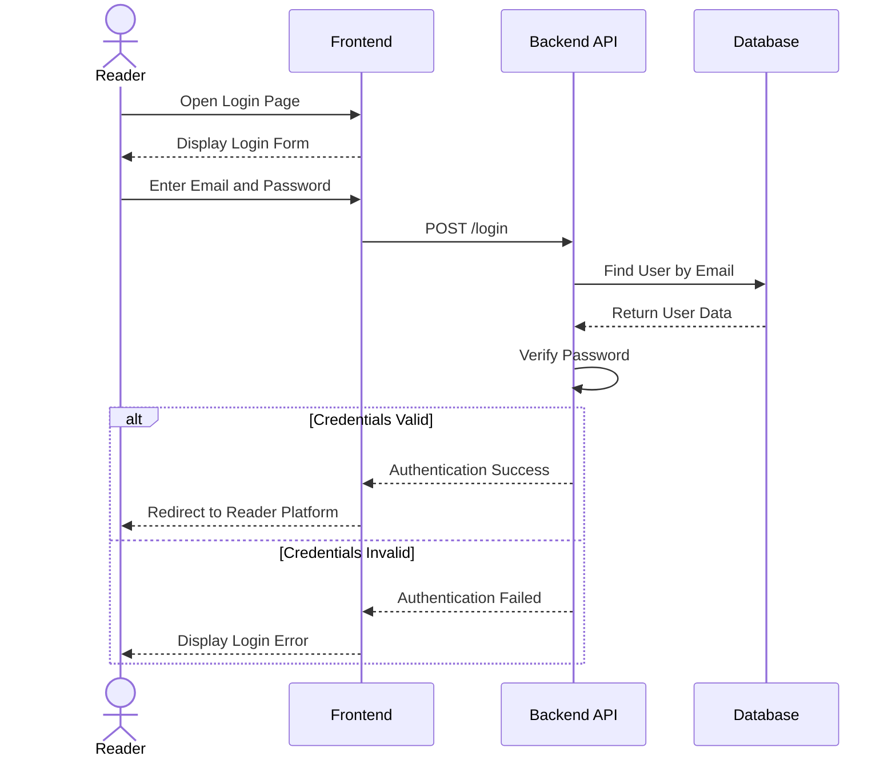
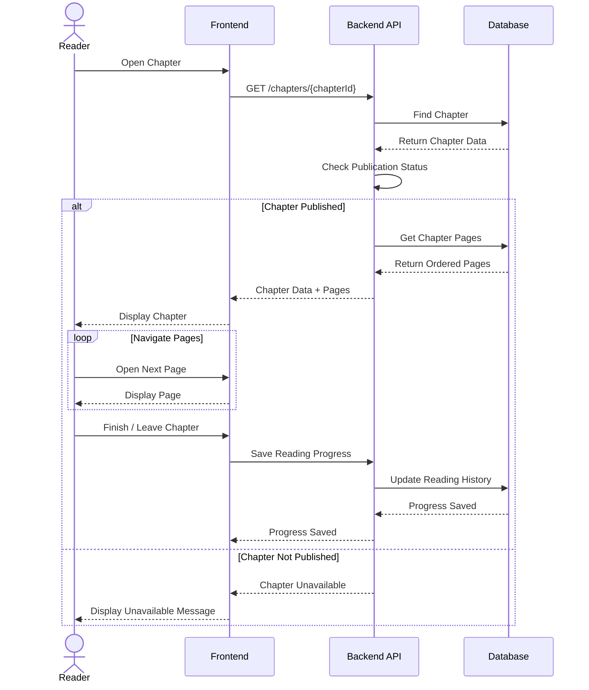
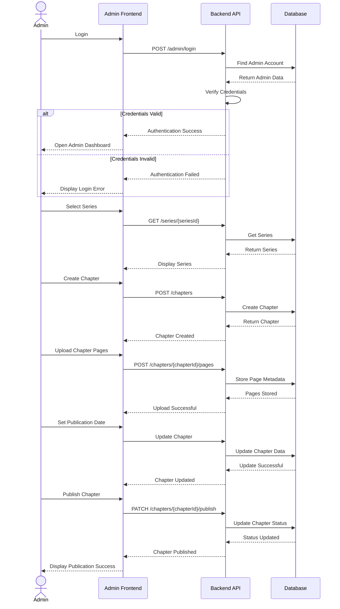

# Sequence Diagram

## Manga / Manhwa / Manhua Reader & CMS

---

## 1. Overview

The Sequence Diagram describes how actors and system components communicate with each other over time to complete specific use cases.

The diagrams in this document focus on three important workflows:

1. Reader Login
2. Reader Reads a Chapter
3. Admin Publishes a Chapter

The main system components are:

- Reader
- Admin
- Frontend
- Admin Frontend
- Backend API
- Database

---

## 2. Reader Login

### 2.1 Description

This sequence describes how a Reader authenticates with the system.

### 2.2 Sequence Flow

### 2.3 Main Flow

1. Reader opens the Login page.
2. Frontend displays the login form.
3. Reader enters their credentials.
4. Frontend sends the credentials to the Backend API.
5. Backend searches for the user in the database.
6. Backend verifies the provided password.
7. If the credentials are valid, authentication succeeds.
8. Frontend redirects the Reader to the Reader Platform.
9. If the credentials are invalid, an error is displayed.

---

## 3. Reader Reads a Chapter

### 3.1 Description

This sequence describes how a Reader opens a published chapter and retrieves its pages.

### 3.2 Sequence Flow

### 3.3 Main Flow

1. Reader selects a chapter.
2. Frontend requests the chapter from the Backend API.
3. Backend retrieves the chapter from the database.
4. Backend checks whether the chapter is published.
5. If the chapter is not published, access is rejected.
6. If the chapter is published, Backend retrieves its pages.
7. Database returns the pages in their defined order.
8. Backend sends the chapter data and pages to the Frontend.
9. Frontend displays the chapter.
10. Reader navigates through the chapter pages.
11. When the Reader finishes or leaves the chapter, the Frontend sends reading progress.
12. Backend stores or updates the Reader's reading history.

---

## 4. Admin Publishes a Chapter

### 4.1 Description

This sequence describes how an Admin creates and publishes a chapter through the Admin CMS.

### 4.2 Sequence Flow

### 4.3 Main Flow

1. Admin opens the Admin CMS.
2. Admin submits login credentials.
3. Backend authenticates the Admin.
4. Admin opens the dashboard.
5. Admin selects the target series.
6. Admin creates a new chapter.
7. Backend stores the chapter.
8. Admin uploads the chapter pages.
9. Backend stores the page metadata and ordering.
10. Admin sets the publication date.
11. Backend updates the chapter information.
12. Admin selects the publish action.
13. Backend updates the chapter publication status.
14. The chapter becomes available to Readers.

---

## 5. Component Interaction Summary

| Actor | Component | Responsibility |
|---|---|---|
| Reader | Frontend | Provides the Reader interface |
| Admin | Admin Frontend | Provides the CMS interface |
| Frontend | Backend API | Sends requests and receives system data |
| Admin Frontend | Backend API | Sends administrative requests |
| Backend API | Database | Reads and modifies persistent data |
| Database | Backend API | Returns requested data or confirms changes |

---

## 6. Sequence Diagram Summary

| Sequence | Primary Actor | Main Process |
|---|---|---|
| Reader Login | Reader | Authenticate user credentials |
| Reader Reads a Chapter | Reader | Retrieve and display a published chapter |
| Admin Publishes a Chapter | Admin | Create, configure, and publish a chapter |

---

## 7. Related Documentation

- [Software Requirements Specification](SRS.md)
- [Use Case Documentation](use-case.md)
- [Activity Diagram](activity-diagram.md)
- Database / ERD documentation
- System Architecture documentation

---

## 8. Completion Criteria

The Sequence Diagram documentation is considered complete when:

- Reader authentication flow is documented.
- Reader chapter-reading flow is documented.
- Admin chapter publication flow is documented.
- Actor-to-frontend communication is represented.
- Frontend-to-Backend communication is represented.
- Backend-to-Database communication is represented.
- Important success and failure conditions are represented.
- The documented sequences are consistent with the SRS, Use Case Diagram, and Activity Diagram.