# Use Case Documentation

## Manga / Manhwa / Manhua Reader & CMS

---

## 1. Overview

The Use Case Diagram describes the interactions between system users and the Manga / Manhwa / Manhua Reader & CMS.

The system has two primary actors:

- Reader
- Admin

---

## 2. Actors

### 2.1 Reader

The Reader is a user who accesses the Reader Platform to discover and read manga, manhwa, and manhua.

The Reader can:

- Register
- Login
- Logout
- Browse series
- Search series
- Filter series
- View series details
- View chapter lists
- Read chapters
- Navigate chapter pages
- Navigate between chapters
- Bookmark series
- View bookmarks
- View reading history
- Continue reading
- Comment on chapters

---

### 2.2 Admin

The Admin is an authorized user who manages the platform through the Admin CMS.

The Admin can:

- Login
- Logout
- View dashboard
- Manage series
- Manage genres
- Manage chapters
- Manage chapter pages
- Publish and unpublish chapters
- Manage users
- Moderate comments

---

## 3. Use Case List

### 3.1 Reader Use Cases

| ID | Use Case | Description |
|---|---|---|
| UC-R01 | Register | Create a new user account |
| UC-R02 | Login | Authenticate as a user |
| UC-R03 | Logout | End the current session |
| UC-R04 | Browse Series | Browse available series |
| UC-R05 | Search Series | Search for a series |
| UC-R06 | Filter Series | Filter series by content type or genre |
| UC-R07 | View Series Detail | View information about a series |
| UC-R08 | View Chapter List | View chapters belonging to a series |
| UC-R09 | Read Chapter | Read a published chapter |
| UC-R10 | Navigate Chapter Pages | Navigate through chapter pages |
| UC-R11 | Navigate Chapters | Move between previous and next chapters |
| UC-R12 | Bookmark Series | Add a series to bookmarks |
| UC-R13 | View Bookmarks | View bookmarked series |
| UC-R14 | View Reading History | View previously read content |
| UC-R15 | Continue Reading | Continue from saved reading progress |
| UC-R16 | Comment on Chapter | Submit a comment on a chapter |

---

### 3.2 Admin Use Cases

| ID | Use Case | Description |
|---|---|---|
| UC-A01 | Login | Authenticate as an administrator |
| UC-A02 | Logout | End the administrator session |
| UC-A03 | View Dashboard | View basic system statistics |
| UC-A04 | Manage Series | Create, view, update, and delete series |
| UC-A05 | Manage Genres | Create, view, update, and delete genres |
| UC-A06 | Manage Chapters | Create, view, update, and delete chapters |
| UC-A07 | Manage Chapter Pages | Upload, reorder, replace, and delete chapter pages |
| UC-A08 | Publish/Unpublish Chapter | Control chapter publication status |
| UC-A09 | Manage Users | View and manage user accounts |
| UC-A10 | Moderate Comments | Review and delete comments |

---

## 4. Use Case Diagram

```mermaid
flowchart LR

    Reader["Reader"]
    Admin["Admin"]

    subgraph SYSTEM["Manga / Manhwa / Manhua Reader & CMS"]

        %% Authentication
        Register(("Register"))
        Login(("Login"))
        Logout(("Logout"))

        %% Content Discovery
        Browse(("Browse Series"))
        Search(("Search Series"))
        Filter(("Filter Series"))
        Detail(("View Series Detail"))
        ChapterList(("View Chapter List"))
        RecentAdded(("View Recently Added"))
        RecentUpdated(("View Recently Updated"))
        LatestChapters(("View Latest Chapters"))

        %% Reading
        Read(("Read Chapter"))
        Pages(("Navigate Chapter Pages"))
        Navigate(("Navigate Previous / Next Chapter"))

        %% User Features
        Bookmark(("Bookmark Series"))
        Bookmarks(("View Bookmarks"))
        History(("View Reading History"))
        Continue(("Continue Reading"))
        Comment(("Comment on Chapter"))

        %% Admin CMS
        Dashboard(("View Dashboard"))
        ManageSeries(("Manage Series"))
        ManageGenres(("Manage Genres"))
        ManageChapters(("Manage Chapters"))
        ManagePages(("Manage Chapter Pages"))
        Publish(("Publish / Unpublish Chapter"))
        ManageUsers(("Manage Users"))
        ModerateComments(("Moderate Comments"))
    end

    %% Reader
    Reader --- Register
    Reader --- Login
    Reader --- Logout

    Reader --- Browse
    Reader --- Search
    Reader --- Filter
    Reader --- Detail
    Reader --- ChapterList
    Reader --- RecentAdded
    Reader --- RecentUpdated
    Reader --- LatestChapters

    Reader --- Read
    Reader --- Pages
    Reader --- Navigate

    Reader --- Bookmark
    Reader --- Bookmarks
    Reader --- History
    Reader --- Continue
    Reader --- Comment

    %% Admin
    Admin --- Login
    Admin --- Logout
    Admin --- Dashboard
    Admin --- ManageSeries
    Admin --- ManageGenres
    Admin --- ManageChapters
    Admin --- ManagePages
    Admin --- Publish
    Admin --- ManageUsers
    Admin --- ModerateComments

    %% Relationships
    Read -.->|includes| Pages
    Read -.->|includes| Navigate
    Continue -.->|uses| History
    ManageChapters -.->|includes| Publish
```



---

## 4. Reader Use Case Relationships

### UC-R01 — Register

**Actor:** Reader

**Description:**  
Allows a visitor to create a new user account.

**Precondition:**

- User does not have an existing account.

**Main Flow:**

1. User opens the registration page.
2. User enters registration information.
3. System validates the information.
4. System creates the account.
5. Registration is completed.

---

### UC-R02 — Login

**Actor:** Reader

**Description:**  
Allows a registered user to authenticate.

**Precondition:**

- User has a valid account.

**Main Flow:**

1. User opens the login page.
2. User enters credentials.
3. System validates the credentials.
4. System creates an authenticated session.
5. User enters the Reader Platform.

---

### UC-R04 — Browse Series

**Actor:** Reader

**Description:**  
Allows users to browse available manga, manhwa, and manhua.

**Main Flow:**

1. User opens the browse page.
2. System retrieves available series.
3. System displays the series.
4. User selects a series.

---

### UC-R05 — Search Series

**Actor:** Reader

**Description:**  
Allows users to search for series.

**Main Flow:**

1. User enters a search query.
2. System processes the query.
3. System retrieves matching series.
4. System displays the results.

---

### UC-R06 — Filter Series

**Actor:** Reader

**Description:**  
Allows users to filter series.

Possible filters include:

- Content type
- Genre

**Main Flow:**

1. User selects a filter.
2. System processes the selected filter.
3. System retrieves matching series.
4. System displays the results.

---

### UC-R07 — View Series Detail

**Actor:** Reader

**Description:**  
Allows users to view detailed information about a series.

The system may display:

- Title
- Cover
- Description
- Content type
- Genres
- Chapter list
- Latest chapter
- Update information

---

### UC-R09 — Read Chapter

**Actor:** Reader

**Description:**  
Allows users to read a published chapter.

**Precondition:**

- Chapter exists.
- Chapter is published.

**Main Flow:**

1. User opens a chapter.
2. System verifies chapter availability.
3. System retrieves chapter pages.
4. System displays the pages.
5. User reads the chapter.

---

### UC-R10 — Navigate Chapter Pages

**Actor:** Reader

**Description:**  
Allows users to move through pages within a chapter.

---

### UC-R11 — Navigate Chapters

**Actor:** Reader

**Description:**  
Allows users to navigate to previous or next chapters when available.

---

### UC-R12 — Bookmark Series

**Actor:** Reader

**Description:**  
Allows authenticated users to save a series to their bookmarks.

**Precondition:**

- User is authenticated.

**Main Flow:**

1. User opens a series.
2. User selects the bookmark option.
3. System creates the bookmark.
4. Series appears in the user's bookmarks.

---

### UC-R13 — View Bookmarks

**Actor:** Reader

**Description:**  
Allows authenticated users to view their bookmarked series.

---

### UC-R14 — View Reading History

**Actor:** Reader

**Description:**  
Allows authenticated users to view previously read content.

---

### UC-R15 — Continue Reading

**Actor:** Reader

**Description:**  
Allows authenticated users to continue reading from previously stored reading progress.

**Precondition:**

- Reading progress exists.

---

### UC-R16 — Comment on Chapter

**Actor:** Reader

**Description:**  
Allows authenticated users to submit comments on chapters.

**Precondition:**

- User is authenticated.
- Chapter exists.

**Main Flow:**

1. User opens a chapter.
2. User enters a comment.
3. System validates the comment.
4. System stores the comment.
5. The comment becomes visible according to moderation rules.

---

## 5. Admin Use Case Relationships

### UC-A01 — Login

**Actor:** Admin

**Description:**  
Allows an administrator to authenticate and access the Admin CMS.

---

### UC-A03 — View Dashboard

**Actor:** Admin

**Description:**  
Allows administrators to view basic platform statistics and recent activity.

Possible information:

- Total series
- Total chapters
- Total users
- Total comments
- Recently added series
- Recently published chapters

---

### UC-A04 — Manage Series

**Actor:** Admin

**Description:**  
Allows administrators to manage series.

Operations include:

- Create series
- View series
- Update series
- Delete series
- Manage series cover
- Assign content type
- Assign genres

---

### UC-A05 — Manage Genres

**Actor:** Admin

**Description:**  
Allows administrators to manage genres.

Operations include:

- Create genre
- View genre
- Update genre
- Delete genre

---

### UC-A06 — Manage Chapters

**Actor:** Admin

**Description:**  
Allows administrators to manage chapters belonging to a series.

Operations include:

- Create chapter
- View chapter
- Update chapter
- Delete chapter
- Set publication date

---

### UC-A07 — Manage Chapter Pages

**Actor:** Admin

**Description:**  
Allows administrators to manage image pages belonging to a chapter.

Operations include:

- Upload pages
- View pages
- Reorder pages
- Replace pages
- Delete pages

---

### UC-A08 — Publish/Unpublish Chapter

**Actor:** Admin

**Description:**  
Allows administrators to control whether a chapter is publicly available.

Possible states:

```text
Draft
Published
Unpublished